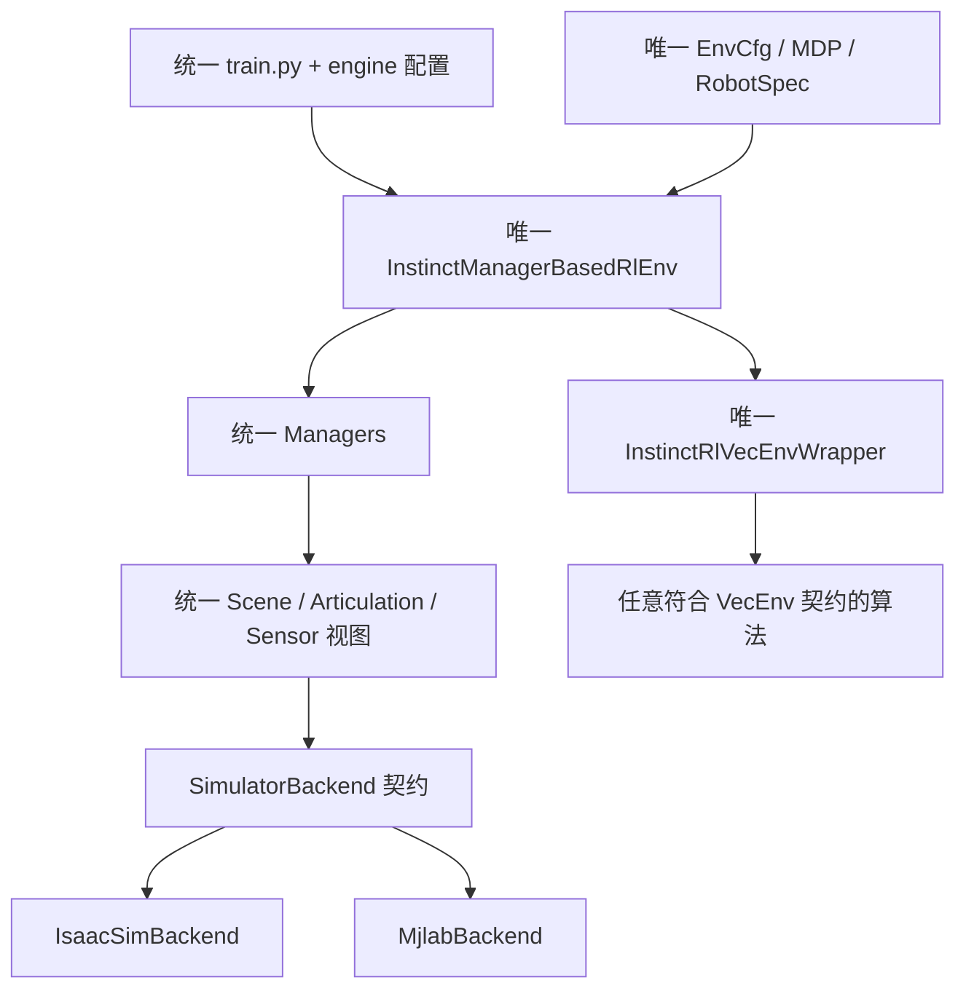
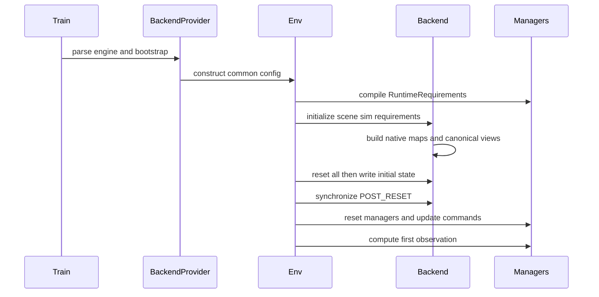
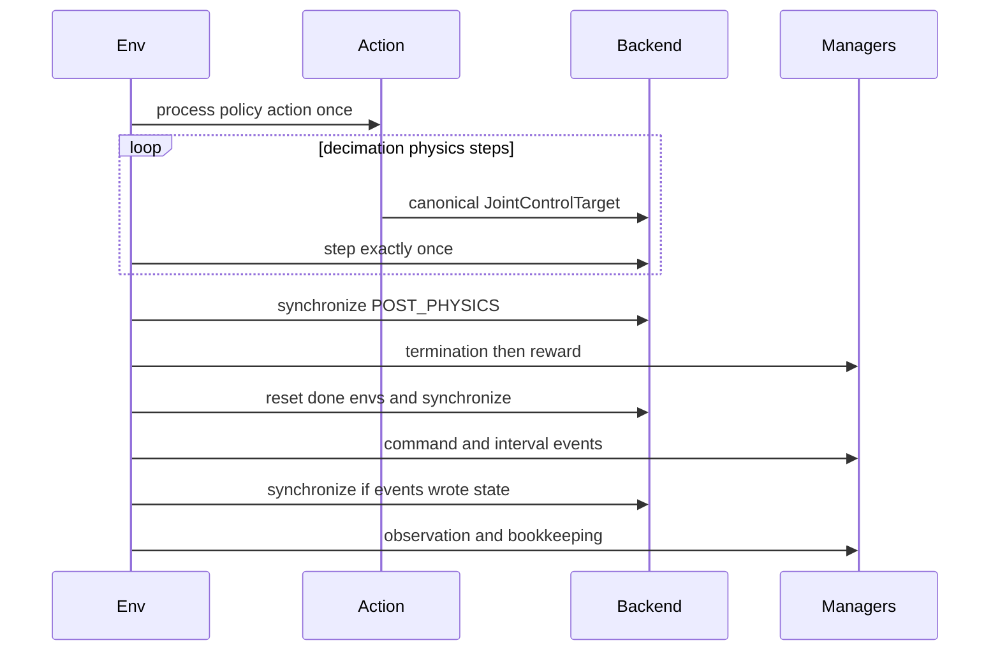

# InstinctLab 统一训练引擎方案

## 架构目标

模仿 PBHC 的依赖方向，但将统一边界提升到 Manager-Based 环境，并补齐状态布局、控制模式和 capability：

- 只有一个项目自有的 `InstinctManagerBasedRlEnv`。
- 只有一套 Manager、Task、MDP、算法 wrapper 和训练入口。
- Isaac Sim 与 MJLab 只实现 `SimulatorBackend`，不各自复制任务和 Manager。
- 关节统一为显式冻结的 DFS 顺序，body 同样使用显式 DFS 规范；四元数、观测、动作和控制目标均使用 canonical 规范。
- 首先迁移 `Instinct-Locomotion-Flat-G1-v0`。



最终同一任务只修改引擎参数：

```bash
python scripts/instinct_rl/train.py --engine isaacsim --task Instinct-Locomotion-Flat-G1-v0
python scripts/instinct_rl/train.py --engine mjlab   --task Instinct-Locomotion-Flat-G1-v0
```

## SimulatorBackend 契约

### 1. Canonical 数据规范

`N` 表示环境数，`J` 表示 canonical 关节数，`B` 表示 canonical body 数，`H` 表示接触历史长度。

- 所有运行时数据均为 backend device 上的 batched `torch.Tensor`，浮点状态默认 `float32`。
- 四元数统一为 `WXYZ`；坐标系统一右手系、Z-up。
- `root` 明确定义为机器人 root link，而不是质心；root/body 位置为绝对 world 坐标。
- 线速度和角速度带 `_w` 的字段均在 world frame，带 `_b` 的派生字段由公共层统一计算。
- 关节和 body 顺序以 `RobotSpec.joint_names/body_names` 中显式冻结的 DFS 列表为唯一真值，禁止在运行时依赖 URDF、USD 或 MJCF 的隐式遍历结果。
- 动作、状态写入、reward selector、对称映射和 checkpoint 全部使用 canonical 顺序。
- `sim_dt=0.005 s`、`decimation=4`、`policy_dt=0.02 s` 首阶段固定一致。
- `joint_acc` 统一按相邻 physics step 的 joint velocity 有限差分计算，reset 后清零。
- `applied_joint_effort` 表示引擎实际施加到关节的广义执行器力矩，而不是控制目标。

G1 29-DOF 的 `canonical_joint_order=dfs_v1` 固定为当前 MJCF 的 DFS 顺序：

```python
(
    "waist_pitch_joint",
    "waist_roll_joint",
    "waist_yaw_joint",
    "left_hip_pitch_joint",
    "left_hip_roll_joint",
    "left_hip_yaw_joint",
    "left_knee_joint",
    "left_ankle_pitch_joint",
    "left_ankle_roll_joint",
    "right_hip_pitch_joint",
    "right_hip_roll_joint",
    "right_hip_yaw_joint",
    "right_knee_joint",
    "right_ankle_pitch_joint",
    "right_ankle_roll_joint",
    "left_shoulder_pitch_joint",
    "left_shoulder_roll_joint",
    "left_shoulder_yaw_joint",
    "left_elbow_joint",
    "left_wrist_roll_joint",
    "left_wrist_pitch_joint",
    "left_wrist_yaw_joint",
    "right_shoulder_pitch_joint",
    "right_shoulder_roll_joint",
    "right_shoulder_yaw_joint",
    "right_elbow_joint",
    "right_wrist_roll_joint",
    "right_wrist_pitch_joint",
    "right_wrist_yaw_joint",
)
```

该列表虽然与当前 MJCF native 顺序一致，MJLab adapter 仍必须按名称校验，不得假定永远是 identity map。Isaac adapter 则把 PhysX/URDF 的 BFS 顺序映射到该 DFS 顺序。

G1 的 `canonical_body_order=dfs_v1` 同样按 popsicle MJCF 显式冻结：

```python
(
    "torso_link",
    "waist_roll_link",
    "waist_yaw_link",
    "pelvis",
    "pelvis_contour_link",
    "left_hip_pitch_link",
    "left_hip_roll_link",
    "left_hip_yaw_link",
    "left_knee_link",
    "left_ankle_pitch_link",
    "left_ankle_roll_link",
    "LL_FOOT",
    "right_hip_pitch_link",
    "right_hip_roll_link",
    "right_hip_yaw_link",
    "right_knee_link",
    "right_ankle_pitch_link",
    "right_ankle_roll_link",
    "LR_FOOT",
    "imu_in_pelvis",
    "logo_link",
    "head_link",
    "imu_in_torso",
    "mid360_link",
    "left_shoulder_pitch_link",
    "left_shoulder_roll_link",
    "left_shoulder_yaw_link",
    "left_elbow_link",
    "left_wrist_roll_link",
    "left_wrist_pitch_link",
    "left_wrist_yaw_link",
    "left_rubber_hand",
    "right_shoulder_pitch_link",
    "right_shoulder_roll_link",
    "right_shoulder_yaw_link",
    "right_elbow_link",
    "right_wrist_roll_link",
    "right_wrist_pitch_link",
    "right_wrist_yaw_link",
    "right_rubber_hand",
)
```

`RobotSpec` 另行声明 controlled joints、collision bodies 与 sensor bodies 子集；不可通过“有无 actuator/contact reporter”反推 canonical 全量列表。

`ArticulationState` 至少暴露：

- `root_pos_w [N,3]`、`root_quat_w [N,4]`。
- `root_lin_vel_w [N,3]`、`root_ang_vel_w [N,3]`。
- `body_pos_w [N,B,3]`、`body_quat_w [N,B,4]`。
- `body_lin_vel_w [N,B,3]`、`body_ang_vel_w [N,B,3]`。
- `joint_pos/joint_vel/joint_acc/applied_joint_effort [N,J]`。
- `default_joint_pos [N,J]`、`soft_joint_pos_limits [N,J,2]`、velocity/effort limits。

`ContactState` 统一暴露：

- `body_names` 使用 canonical body 子序列。
- `net_forces_w [N,B,3]`。
- `net_forces_w_history [N,H,B,3]`，MJLab adapter 负责从其 native `[N,B,H,3]` 转置。
- `contact_active [N,B]` 与 `contact_active_history [N,H,B]`，由统一 `force_threshold` 产生；Flat 的 illegal-contact 与 feet-slide gate 优先依赖该布尔语义。
- `current_air_time/current_contact_time/last_air_time/last_contact_time [N,B]`。
- Force threshold、history 更新、最新帧位于 index 0、air-time 和 reset 清零语义由 `ContactSensorSpec` 固化，不由 reward 自行猜测。
- PhysX 与 MuJoCo 的接触力构成和瞬态冲量不可逐值等价；需要绝对力值的任务必须声明 `CONTACT_FORCE_VECTOR` capability 与允许误差，不能只凭字段同名通过验收。

### 2. Runtime 接口

公共接口不得出现 Isaac Lab、PhysX、MuJoCo、mjwarp 或 USD 类型。建议的最小协议为：

```python
class SimulatorBackend(Protocol):
    capabilities: frozenset[Capability]
    scene: SceneView
    num_envs: int
    device: torch.device
    sim_dt: float

    def initialize(
        self,
        scene_spec: SceneSpec,
        sim_spec: SimulationSpec,
        requirements: RuntimeRequirements,
    ) -> None: ...

    def reset(self, env_ids: torch.Tensor) -> None: ...
    def write_root_state(
        self, entity: str, state_wxyz: torch.Tensor, env_ids: torch.Tensor
    ) -> None: ...
    def write_joint_state(
        self, entity: str, pos: torch.Tensor, vel: torch.Tensor,
        env_ids: torch.Tensor, joint_ids: torch.Tensor | None = None,
    ) -> None: ...
    def set_joint_control_target(
        self, entity: str, target: JointControlTarget,
        env_ids: torch.Tensor | None = None,
    ) -> None: ...
    def set_external_wrench(
        self, entity: str, body_ids: torch.Tensor,
        force_w: torch.Tensor, torque_w: torch.Tensor,
        env_ids: torch.Tensor,
    ) -> None: ...
    def set_body_material(self, values: MaterialProperties) -> None: ...
    def set_body_mass_properties(self, values: MassProperties) -> None: ...
    def synchronize(self, phase: SensorReadPhase) -> None: ...
    def step(self) -> None: ...
    def render(self, mode: str) -> object | None: ...
    def close(self) -> None: ...
```

接口语义：

- `RuntimeRequirements` 在创建仿真前由 Scene/Event 配置编译得到，包含所需 sensor、DR 字段和 capability；MJLab 据此执行 `expand_model_fields`，Isaac 据此准备 PhysX view。
- `reset(env_ids)` 只清除引擎内部 solver、缓存和 sensor history；公共 Event Manager 随后写入采样后的 root/joint 状态。
- `write_root_state` 接受绝对 world 状态 `[pos3, quat4 WXYZ, lin_vel3, ang_vel3]`；环境原点由公共 reset event 加入，backend 不隐式平移。
- `step()` 恰好推进一个 physics step，更新 q/qdot、执行器输出和 substep contact history；它不承诺所有派生 link pose/velocity 已同步。
- `synchronize()` 不推进时间，负责刷新运动学、传感器和 canonical view。统一 Env 在 decimation 后、termination/reward 前必须调用一次；reset/event 写状态后、observation 前再调用一次。
- `SensorReadPhase` 至少区分 `POST_PHYSICS` 与 `POST_RESET`，禁止 MJLab reward/termination 读取滞后一个 substep 的派生状态。
- reset、observation noise、command 与 DR 的随机数全部由公共 Manager 采样；backend 只应用已经采样好的 tensor，不维护任务级 RNG。
- `MaterialProperties` 与 `MassProperties` 携带目标值而不是 distribution range，确保两后端收到同一批 per-env 样本。
- Manager/MDP 只读 `SceneView`，不直接读 backend native tensor。

### 3. 控制契约

首阶段采用“统一 target、各后端原生隐式 PD”：

- 公共 `JointPositionAction` 只负责 `q_target = default_q + action_scale * action`，结果按 canonical 顺序写入 `JointControlTarget`。
- `RobotSpec` 统一保存每个 canonical joint 的 `kp/kd/armature/effort_limit/velocity_limit`。
- `IsaacSimBackend` 使用 Isaac Lab implicit actuator；`MjlabBackend` 使用 `BuiltinPdActuatorCfg`。
- 两后端接收相同的 position/velocity target 和执行器参数，但隐式积分属于引擎实现，因此不承诺逐步力矩完全相同。
- `JointControlTarget` 从第一版就支持 `POSITION`、`VELOCITY` 和 `EFFORT`，避免后续修改 backend API。

第二阶段再增加可选的公共显式 PD：

- 公共 Actuator Manager 在每个 physics step 用 canonical `q/qdot` 计算并裁剪 effort。
- Isaac 后端关闭内部 PD 后写 effort target；MJLab 后端切换为 `BuiltinMotorActuatorCfg`。
- actuator delay、motor strength 和 torque noise 同时迁到公共层。
- checkpoint metadata 记录 `control_semantics=native_implicit_v1` 或 `explicit_effort_v1`；同一 control semantics 可跨引擎加载，不同 semantics 默认告警。

### 4. Canonical/native 映射

每个 backend 在资产编译后严格按名称建立一次映射：

```python
native_ids_for_canonical = torch.tensor(
    [native_names.index(name) for name in canonical_names],
    device=device,
)
canonical_value = native_value[..., native_ids_for_canonical]
```

- 写入时使用 `native_ids_for_canonical` 作为 native joint/body IDs，value 保持 canonical 列顺序。
- 另建 inverse map 仅用于必须生成完整 native-order tensor 的 API。
- 初始化时检查名称唯一、无缺失、无额外受控关节；失败时立即报出具体差集。
- Isaac raw PhysX pose 为 `XYZW`，但 Isaac Lab `ArticulationData` 已转换为 `WXYZ`；adapter 必须验证并只在 raw API 边界转换。canonical root velocity读取 `root_link_vel_w`，不得误用指向 COM velocity 的 `root_vel_w` 别名。
- Action joint 顺序由 canonical joint names 决定，不再从 actuator group 的遍历顺序推导。
- 对称映射、action scale、PD 参数和 joint selector 均按名称编译成 DFS index，禁止继续维护依赖 BFS 的裸数字列表。
- checkpoint 写入 `canonical_joint_order=dfs_v1`、完整 joint-name 列表及其 hash。
- 对旧 Isaac BFS checkpoint 提供显式兼容 wrapper：策略输入前将 DFS observation 的 joint segments 转回 BFS，策略输出后将 BFS action 转成 DFS；新 checkpoint 不再保存 BFS 布局。

### 5. Capability 与 Locomotion Flat 最小集合

Capability 在环境创建前严格校验，不允许 backend 静默忽略请求。Flat 首阶段要求：

- batched simulation、plane terrain、root/joint state read/write。
- position target + native implicit PD。
- contact force、三帧 contact history、air/contact time。
- sliding-friction DR、body mass/inertia properties、外力矩、root velocity push。
- human viewer；`rgb_array` 可作为非阻塞扩展。

首个统一 Flat 基线采用单一 `sliding_friction_range=(0.2,0.6)`：公共 Event Manager 采样一个系数，Isaac 将 static/dynamic friction 都设为该值，MJLab 写 `geom_friction[...,0]`。ground friction 显式固定为 `1.0`；PhysX multiply 与 MuJoCo contact combine 仍作为 backend metadata，不宣称等价。

MJLab 没有与 Isaac 等价的逐 geom restitution DR，因此两端 `restitution=0` 固定；以后若实现 MuJoCo `solref/solimp` 等价映射，再增加 `DR_RESTITUTION` capability。任何不支持的 capability 都应在启动时失败，而不是 no-op。

Base mass DR 统一为 `mass_dr_mode=scale_inertia_with_mass_v1`：公共层采样 torso mass delta，基于 nominal mass 算出目标 mass，并按相同比例缩放 inertia、保持 COM 不变，再把目标属性交给 backend。若某后端无法写入该完整属性集，则首阶段关闭该 event，不能各自采用 add-mass 与 pseudo-inertia 两套语义。

### 6. 生命周期

初始化：



单个 policy step：



reset 的精确顺序固定为：curriculum → backend reset → scene/sensor reset → reset events 与状态写入 → backend synchronize → observation/action/reward/curriculum/command/event/termination/monitor reset → command update → episode counter 清零 → observation。`terminated` 与 `truncated` 均为 `[N] bool`，time-out 只进入 `truncated`，wrapper 额外提供 bootstrap 所需的 `extras["time_outs"]`。

### 7. Task、Manager 与算法契约

仅统一 simulator tensor 不足以得到同一个 MDP；以下 schema 同样必须由公共配置冻结：

- `ObservationSpec`：固定 group、term 名称、term 顺序、shape、scale、clip、noise、history 与 flatten 规则。Flat policy 顺序固定为 `base_ang_vel(3) → projected_gravity(3) → velocity_commands(3) → joint_pos(29) → joint_vel(29) → actions(29)`，总维度 96；critic 在最前增加 `base_lin_vel(3)`，总维度 99。
- Observation 中所有 joint segment 使用 `dfs_v1`；`last_action` 明确定义为最近一次原始 policy action，而不是 scaled target 或 actuator-delayed target。
- Noise 由公共 Observation Manager 按相同分布和 per-env RNG stream 采样；wrapper 必须按 frozen term list 展平，禁止依赖 `dict.items()` 或后端 manager 的插入顺序。
- `ActionSpec`：Flat 输入固定 `[N,29] float32`、DFS 顺序；明确 raw action clip、per-joint scale、default offset、target velocity=0 和 target 在四个 substep 内保持不变。
- `CommandSpec`：冻结采样范围、standing/heading 比例、重采样周期、heading controller 与 yaw-frame 定义；初次 reset 和 episode reset 后都必须执行 `command.compute(0)`。
- `RewardSpec`：只保留一个公共 Reward Manager；固定 group 与 term 顺序、公式、selector、weight，并统一乘 `policy_dt`。Flat 单 group 对算法恒返回 `[N,1]`，multi-reward 按显式 group order 返回 `[N,R]`。
- `TerminationSpec`：固定 termination 与 time-out 的分类、计算时刻、contact history reduction 和 reset 后返回 post-reset observation 的行为。
- `VecEnvSpec`：统一 Gym 五元组到算法四元组的转换、policy/critic observations、`get_obs_format()`、reward shape、done dtype 与稳定的 `extras/{log,step,episode,observations,time_outs}` keys。
- `ManagerLifecycleSpec`：固定 manager 构造、startup、step、reset、monitor、recorder 与 metrics 的顺序，不继承任一上游环境的隐式顺序。

### 8. RNG 与随机化契约

- `ExperimentSeed` 派生出独立的 `reset/command/observation_noise/event/terrain` streams；分布采样只发生在公共 Manager。
- 每个 stream 使用 `(base_seed, global_step, env_id, term_id)` 可重建的 per-env 状态，后端初始化消耗的随机数不得改变任务采样序列。
- DR 明确记录 distribution、operation、共享粒度、bucket 数和 nominal baseline；backend 接收目标 tensor 后只负责应用。
- Contract 测试比较两后端收到的 reset state、command、noise 和 DR 样本完全相同；不要求由不同 solver 演化出的后续状态完全相同。

### 9. Robot、Scene 与资产契约

- `RobotSpec.root_body="torso_link"`，root/body 状态全部采用 link frame；COM 状态只能作为显式派生视图。
- actuator 的 kp、kd、armature、effort limit、velocity limit、default pose、soft limit 与 action scale 按 joint name materialize 为 DFS tensor。
- MJLab native implicit PD 没有与 Isaac 完全相同的 velocity-limit enforcement；Flat 首阶段记录 capability 与 metadata，不伪造相同行为。
- `asset_id=popsicle_torsobase_v1` 同时记录 URDF/MJCF checksum，并对 joint frame、mass、inertia、COM、collision body 集和 self-collision graph 做静态清单测试。
- `SceneSpec` 固定 entity 名、plane 高度、gravity、env spacing、env origins、ground material 和 collision group；reset event 显式添加 env origin，backend 不做隐式平移。
- External wrench 与 push 固定作用于 canonical body、world-frame force/torque 或 world-frame link velocity。

### 10. Schema 与运行 metadata

checkpoint/run manifest 至少记录：

- task、Observation/Action/Reward/Termination schema hash。
- `canonical_joint_order=dfs_v1`、`canonical_body_order=dfs_v1`、WXYZ 与完整名称列表 hash。
- `asset_id`、两端资产 checksum、`control_semantics`、`joint_acc_source=fd_v1`、contact semantics 与 mass DR mode。
- engine、engine version、backend adapter version、sim/policy dt、solver/integrator/iterations、ground/material 参数和 capability 集。
- seed 与 RNG schema version。

engine 名本身不阻止 checkpoint 加载；schema/control 不兼容时必须报错，只有已注册的兼容转换才能放行。

### 11. 只能版本化、不能宣称数值统一的项目

- PhysX 与 MuJoCo solver、integrator、contact impulse、friction combine、self-collision 和隐式 PD 数值积分。
- 原生隐式 PD 下的逐步 applied torque 与轨迹。
- 接触力峰值和短时冲量；Flat 验收使用 contact event、趋势与 tolerance。
- 后端原生 qacc；公共 reward 只使用 `joint_acc_source=fd_v1`。
- viewer、离屏渲染与 solver 内部容量参数。

这些项目进入 metadata 和 tolerance-based regression，不作为逐帧 tensor equality 条件。

## 两个后端的实现落点

### Isaac Sim

- `AppLauncher` 与 import-order 逻辑放在 `backends/isaacsim/bootstrap.py`。
- USD/URDF、PhysX tensor、Isaac actuator、contact sensor 和 viewer 只出现在 `backends/isaacsim/`。
- 第一阶段继续使用原生 implicit actuator，PD 参数来自公共 `RobotSpec`。
- 将现有 Isaac 状态和接触数据包装成 DFS/WXYZ canonical view；root velocity 必须读取 link frame。旧 BFS checkpoint 只通过显式兼容 wrapper 运行。

### MJLab

- 复用 `ref_code/InstinctMJ` 的 G1 MJCF、执行器参数、`ForceThresholdContactSensor`、terrain hook 和 DR 包装。
- 直接依赖 mjlab `Simulation/Scene/Entity/ContactSensor/dr`，不迁移第二套 Env、Manager、Task、wrapper 或 train 脚本。
- `MjlabBackend` 负责 MJCF native joint/body 重排和所有写入的反向映射。
- 第一阶段用 `BuiltinPdActuatorCfg`；以后显式 PD 模式改用 `BuiltinMotorActuatorCfg`。
- 对外合成一个逻辑 `contact_forces` view，任务继续按 canonical body name 选择 feet 与 illegal-contact bodies。
- decimation 后必须执行 `synchronize(POST_PHYSICS)`，消除当前 reward/termination 所见派生状态滞后一个 substep 的差异。

## 实施步骤

### 1. 冻结规范与 Contract 测试

- 在 `sim/{state,control,scene,robot_spec,backend,capabilities,schema,rng}.py` 定义上述协议和版本号。
- 以当前 G1 MJCF 顺序冻结 `dfs_v1` canonical joint/body 顺序，并固化 WXYZ、root link、单位、控制频率、obs/action/reward/contact schema。
- 建立 `MockSimulatorBackend`，先验证映射、shape、同步相位、reset、Manager 顺序、公共 RNG 和 control target。

### 2. 建立唯一 Manager-Based 环境

- 将 `envs/manager_based_rl_env.py` 重构为不继承 IsaacLab/MJLab 的 `InstinctManagerBasedRlEnv`。
- 统一 Action、Observation、Reward、Event、Termination、Command、Curriculum、Metrics、Recorder 和 Monitor 生命周期。
- 合并两套 `InstinctRlVecEnvWrapper`；按 frozen term order 展平并稳定 extras schema，算法只依赖唯一 VecEnv 接口。

### 3. 抽取 Isaac Sim 后端

- 新建 `backends/isaacsim/{bootstrap,simulator,scene,sensors,assets}.py`。
- 先使原 Locomotion Flat 通过新接口运行，核对 obs/action schema、reward 分项、reset 分布和 checkpoint rollout。
- 对新的 `native_implicit_v1` 基线做短训练回归后再接入 MJLab。

### 4. 提取 MJLab 后端

- 从 `ref_code/InstinctMJ` 提取必要资产与 adapter 代码。
- 实现 canonical/native joint、body、quaternion 和 contact history 映射。
- 实现 native implicit target、状态写入、同步相位、sliding-friction/完整 mass property 应用、external wrench 和 viewer。

### 5. Locomotion Flat 只保留一份 Task

- 将 `tasks/locomotion/config/g1/flat_env_cfg.py` 和 `tasks/locomotion/mdp/` 改为后端无关配置及公共 MDP。
- 速度命令、观测、动作、reward、termination、DR、curriculum、monitor 和 PPO 配置只注册一次。
- 将 material DR 改为公共 sliding-friction 样本并固定 restitution=0；mass DR 只在两端都支持完整 `scale_inertia_with_mass_v1` 时开启。
- `train.py` 先解析 `--engine` 并执行 backend bootstrap，再构造同一个 Env、wrapper 和 runner。
- engine registry 只选择 backend provider，不选择 task implementation。

### 6. 验证、显式 PD 与扩展

- 两后端运行 contract、100-step smoke、2–5 iteration PPO 和 Locomotion 短程收敛回归。
- 先以 Mock/synthetic state 对 obs、reward、termination 和 wrapper 做精确单元测试；再确认两后端收到完全相同的 reset、command、noise 和 DR 样本。
- 关闭 DR/噪声，以相同初态、命令和 action 比较最新状态快照、接触事件和 reward 分项；原生隐式 PD 模式不以逐帧数值相等为验收条件。
- 验证新 `dfs_v1`、同 schema、同 `native_implicit_v1` checkpoint 在两后端可加载并 rollout；旧 Isaac BFS checkpoint 通过兼容 wrapper 单独回归。
- Locomotion 稳定后实现 `explicit_effort_v1`，再比较公共显式 PD 下的逐步 parity。
- 最后按 WholeBody Shadowing、BeyondMimic、Perceptive、HOI、Parkour 扩展 capability。

## 目标目录

```text
source/instinctlab/instinctlab/
├── sim/
│   ├── backend.py
│   ├── capabilities.py
│   ├── control.py
│   ├── rng.py
│   ├── robot_spec.py
│   ├── schema.py
│   ├── scene.py
│   └── state.py
├── managers/
├── envs/manager_based_rl_env.py
├── backends/
│   ├── isaacsim/
│   └── mjlab/
├── tasks/
└── utils/wrappers/
```

## 关键参考实现

本仓库内：

- [现有 Isaac Flat 配置](source/instinctlab/instinctlab/tasks/locomotion/config/g1/flat_env_cfg.py)
- [现有 Isaac G1 资产](source/instinctlab/instinctlab/assets/unitree_g1.py)
- [InstinctMJ Flat 配置](ref_code/InstinctMJ/src/instinct_mj/tasks/locomotion/config/g1/flat_env_cfg.py)
- [InstinctMJ G1 资产](ref_code/InstinctMJ/src/instinct_mj/assets/unitree_g1.py)

原指向仓库外的资料已全文收录到文末附录，避免依赖本机其它目录：

- [PBHC 多引擎实现指南](#附录-a-pbhc-多引擎实现指南)
- [HumanoidVerse 多仿真引擎整合实现](#附录-b-humanoidverse-多仿真引擎整合实现)（指南内部引用）
- [MJLab Entity API](#附录-c-mjlab-entity-api)

## 验收标准

- Locomotion Flat 的 Task、Manager、MDP、wrapper、agent config 和训练入口均只有一份。
- Env、Task 和算法目录没有 Isaac/MJLab SDK import，也没有 `if engine == ...`。
- 两后端对外统一为显式 `dfs_v1` joint/body 顺序和 `WXYZ` 四元数，obs/action schema、控制频率和 tensor shape 完全一致。
- reward/termination 必须读取 decimation 后同步的最新状态；reset 后首帧 command 与 observation 生命周期一致。
- 相同 seed 下，两后端收到的 reset、command、observation noise 和 DR 样本完全一致。
- Contact active/history/air-time、reward dt scaling、termination/truncation、wrapper flatten/order 与 extras schema 通过公共单元测试。
- `native_implicit_v1` 下两端 target 与执行器参数一致；允许引擎隐式积分导致实际力矩和轨迹存在差异。
- 新 checkpoint 原生使用 `dfs_v1`；旧 Isaac BFS checkpoint 可经有版本标记的兼容 wrapper 加载，禁止无 metadata 猜测顺序。
- 不支持的 capability 启动即失败；不得静默忽略 restitution 等配置。
- Mock、双后端 contract、smoke 和短训练回归通过后再迁移下一任务。

---

## 附录 A: PBHC 多引擎实现指南

来源：`/home/yangrr/codes/PBHC/humanoidverse/docs/multi_engine_implementation_guide.md`。原文中指向仓库外的整合说明已改链到附录 B。

### 如何让训练项目支持自由切换仿真引擎

本文是一份**实现指南**，面向：已有一套单引擎训练代码（IsaacGym / IsaacSim / MuJoCo / Genesis 任一），希望改成「换一行配置就能换引擎，任务和算法代码不动」。

本文从本仓库 HumanoidVerse 的结构中抽象出一套**推荐架构**，细节和当前实现的已知偏差见 [附录 B：HumanoidVerse 多仿真引擎整合实现](#附录-b-humanoidverse-多仿真引擎整合实现)。HumanoidVerse 已完成配置注入、训练/部署分层和 IsaacGym 主路径，但 IsaacSim / Genesis 仍有状态布局、生命周期和功能覆盖缺口；不要把本文的目标约束理解为仓库当前已经全部满足。

---

#### 0. 先判断值不值得做

多引擎抽象有成本。下面任一成立再做：

- 训练要用 GPU 并行引擎（IsaacGym / IsaacSim / Genesis），验证 / 部署要用 MuJoCo 或真机。
- 同一套观测、奖励、PPO 要在两个以上物理后端上跑，做 sim2sim。
- 团队会换引擎，但不想分叉任务代码。

如果只有一个引擎、也不打算 sim2sim，不要上这套抽象。

**训练引擎**和**部署后端**建议分成两个接口。训练是向量化 GPU 仿真 + PyTorch；部署是单环境 + ONNX / 真机。硬塞进同一个基类，接口会又胖又歪。HumanoidVerse 就是 `BaseSimulator`（训练）和 `URCIRobot`（部署）两条线。本文主讲训练侧；部署在第 9 节单独说。

---

#### 1. 目标架构

改完之后，项目应长成这样：

```
命令行:  +simulator=isaacgym | isaacsim | genesis | ...
                │
                ▼
        Hydra / 配置组
        simulator._target_ = 具体类路径
                │
                ▼
        Env / Task
        SimulatorClass = get_class(_target_)
        self.sim = SimulatorClass(config, device)
                │
                ▼
        只调用统一接口，只读写统一张量
        （dof_pos, root_states, contact_forces, ...）
                │
        ┌───────┼────────┐
        ▼       ▼        ▼
     IsaacGym IsaacSim Genesis
     (adapter) (adapter) (adapter)
```

三条硬约束：

1. **Env、Reward、Obs、Algo 禁止 import 任何引擎 SDK**（`isaacgym`、`omni.isaac`、`genesis`、`mujoco` 都不行）。
2. 换引擎只改配置（或一行 CLI），不改 Python 任务文件。
3. 所有 adapter 对外的状态布局必须一致，以你选定的**规范引擎**为准。

这是改造完成后的验收目标。当前 HumanoidVerse 的任务代码仍有少量 `simulator.config.name` 分支。另有一个不同层级的耦合：IsaacGym adapter 使用的 `envs/env_utils/terrain.py` 直接依赖 IsaacGym；它不会进入 IsaacSim / Genesis 启动路径，但会阻碍把 terrain 生成器进一步做成引擎无关组件。

---

#### 2. 实施顺序（按这个做，不要反过来）

不要先写三个 adapter。正确顺序是：

1. 选定规范引擎，冻结张量约定  
2. 从现有 Env 里抽出 `BaseSimulator` 接口  
3. 把现有引擎改成第一个 adapter，确认训练还能跑  
4. 加配置注入（Hydra group + `_target_`）  
5. 处理入口脚本的 SDK 引导（import 顺序、AppLauncher）  
6. 加第二个引擎的 adapter  
7. 写对齐测试，再扩第三个  

每一步都要保持「原引擎训练不回退」。接口是从能跑的代码里抽出来的，不是先设计再填。

---

#### 3. 第 1 步：选定规范，冻结约定

选一个你现在最熟、结果最可信的引擎当**规范**。HumanoidVerse 选的是 IsaacGym。规范一旦定了，其它引擎都向它看齐，而不是互相迁就。

必须书面冻结这些约定（建议直接写进接口注释）：

##### 3.1 状态张量

| 字段 | 推荐 shape | 说明 |
|------|------------|------|
| `dof_pos` / `dof_vel` | `(N, dof)` | 关节位置 / 速度 |
| `dof_state` | `(N, dof, 2)` | `[pos, vel]`，reset 时整块写回 |
| `robot_root_states` | `(N, 13)` | `pos(3) + quat(4) + lin_vel(3) + ang_vel(3)` |
| `base_quat` | `(N, 4)` | 四元数，**只选一种**（建议 XYZW） |
| `contact_forces` | `(N, bodies, 3)` | 净接触力 |
| `_rigid_body_pos/rot/vel/ang_vel` | `(N, bodies, …)` | 刚体状态，`rot` 与 `base_quat` 同一约定 |

`N` 是并行环境数。单环境引擎也要用 `N=1` 的 tensor，不要在接口里混 numpy。

这是推荐布局，不是当前仓库所有字段的既成事实。例如 IsaacGym 的底层 `dof_state` 当前保持 `(N * dof, 2)`，IsaacSim / Genesis 的 property 才返回 `(N, dof, 2)`。若不统一，应至少在接口注释和 reset 方法中明确每个字段的实际 shape。

##### 3.2 必须提前拍板的语义

- **四元数**：XYZW 还是 WXYZ。任务层只认一种。IsaacGym 是 XYZW；IsaacSim / Genesis / MuJoCo 内部是 WXYZ，adapter 里转。
- **关节顺序**：以机器人配置里的 `dof_names` 列表为真值，不要用引擎默认 BFS/DFS。
- **控制量**：接口只接受力矩（effort），还是也接受 PD 位置目标。建议训练接口**只吃力矩**，PD 放在 Env 里算，各引擎行为才一致。
- **时间**：`sim_dt = 1/fps`，`policy_dt = control_decimation * sim_dt`。策略频率跨引擎必须相同（例如都是 50 Hz），物理子步可以不同。
- **坐标**：重力轴（通常 Z-up）、接触力在世界系还是机体系统一。

把这些写进 `BaseSimulator` 的 docstring。后面每个 adapter 的 `refresh_sim_tensors()` 都是在落实这份约定。

当前仓库有一个重要反例：IsaacSim 的 `base_quat` 和 `_rigid_body_rot` 已转成 XYZW，但 `robot_root_states[:, 3:7]` 仍保留 Isaac Lab 的 WXYZ，motion-tracking 任务因此在 reset / 保存时按引擎分支转换。新项目应在 adapter 内修正，不要照搬这个例外。

---

#### 4. 第 2 步：抽出训练接口

##### 4.1 接口里该有什么

只放「所有训练引擎都做得到、任务层又必须用」的能力。HumanoidVerse 的最小集合：

```python
class BaseSimulator:
    def __init__(self, config, device): ...

    def set_headless(self, headless): ...
    def setup(self): ...                          # 创建仿真上下文，设置 sim_dt
    def setup_terrain(self, mesh_type): ...
    def load_assets(self): ...                    # 写入 num_dof/num_bodies/dof_names/body_names
    def create_envs(self, num_envs, origins, init_state): ...
    def get_dof_limits_properties(self): ...
    def find_rigid_body_indice(self, body_name): ...
    def prepare_sim(self): ...                    # wrap / 初始化统一张量
    def refresh_sim_tensors(self): ...            # 引擎内部 → 统一张量
    def apply_torques_at_dof(self, torques): ...
    def simulate_at_each_physics_step(self): ...
    def set_actor_root_state_tensor(self, env_ids, root_states): ...
    def set_dof_state_tensor(self, env_ids, dof_states): ...
    def setup_viewer(self): ...
    def render(self, sync_frame_time=True): ...
```

任务层只允许通过这些方法和第 3.1 节的字段与仿真对话。

上面列的是 HumanoidVerse **实际调用所采用的有效签名**。当前 `base_simulator.py` 仍残留旧声明：`load_assets(self, robot_config)` 和四参数 `create_envs(..., env_config)`；`BaseTask` 与三个 adapter 实际使用的是表中零参数 `load_assets()` 和三参数 `create_envs(...)`。实现时应先统一基类与子类签名。

##### 4.2 接口里不要放什么

这些东西一放进去，第二个引擎就会炸：

- 某个 SDK 的 handle（`gym`、`sim`、`viewer` 的引擎类型）
- `gymtorch.unwrap_tensor`、`UsdFileCfg`、`mj_step` 这类 API
- 只对某一个引擎有意义的 domain rand 细节（应放进该 adapter）
- 观测计算、奖励、PPO（那是 Env / Algo 的事）
- 部署用的 ONNX、真实 IMU、DDS（走另一条接口）

原则：**接口描述「仿真器能做什么」，不描述「某个引擎怎么做」。**

##### 4.3 从现有 Env 里拆的方法

打开你现在的 Task / Env，把所有 `self.gym.` / `self.sim.` / `mujoco.` 调用标出来，分成三类：

| 类型 | 处理 |
|------|------|
| 创建 sim、加载 URDF、step、set state | 下沉到 adapter |
| 读 `dof_pos`、算 obs、算 reward | 留在 Env，改为读 `self.simulator.xxx` |
| 引擎特有可视化、debug | adapter 可选方法，Env 用 `hasattr` 或基类空实现 |

拆完后 Env 的物理循环应类似：

```python
def _physics_step(self):
    self.render()
    for _ in range(self.control_decimation):
        torques = self._compute_torques(self.actions)
        self.simulator.apply_torques_at_dof(torques)
        self.simulator.simulate_at_each_physics_step()

def _post_physics_step(self):
    self.simulator.refresh_sim_tensors()
    # 再计算 obs / reward / reset
```

HumanoidVerse 实际把 refresh 放在 `_post_physics_step()` 开头，而不是 decimation 循环内部。

reset：

```python
self.simulator.dof_pos[env_ids] = ...
self.simulator.robot_root_states[env_ids] = ...
self.simulator.set_actor_root_state_tensor(env_ids, self.simulator.all_root_states)
self.simulator.set_dof_state_tensor(env_ids, self.simulator.dof_state)
```

这一步结束的验收标准：**还是只有原来那一个引擎，但 Env 文件里已经没有 SDK import。** 能继续训练，才进入下一步。

---

#### 5. 第 3 步：配置注入，而不是 if-else

不要在 Env 里写：

```python
if cfg.sim_type == "isaacgym":
    self.simulator = IsaacGym(...)
elif cfg.sim_type == "isaacsim":
    self.simulator = IsaacSim(...)
```

引擎一多，Env 就会重新耦合。用「配置指向类路径」：

##### 5.1 目录

```
your_project/
├── config/
│   ├── train.yaml                 # 全局：num_envs, device, ...
│   ├── simulator/
│   │   ├── isaacgym.yaml
│   │   ├── isaacsim.yaml
│   │   └── genesis.yaml
│   └── robot/
│       └── xxx.yaml               # 跨引擎真值：dof_names、限位、PD、资产路径
├── simulators/
│   ├── base.py
│   ├── isaacgym.py
│   ├── isaacsim.py
│   └── genesis.py
├── envs/task.py
└── train.py
```

##### 5.2 每个引擎一份 yaml

```yaml
### config/simulator/isaacgym.yaml
### @package _global_
simulator:
  _target_: your_project.simulators.isaacgym.IsaacGym
  _recursive_: False
  config:
    name: isaacgym
    sim:
      fps: 200
      control_decimation: 4
      # 下面只放该引擎自己的物理参数
      physx: { ... }
```

若使用 `hydra.utils.instantiate(config.simulator)`，应加 `_recursive_: False`，避免递归实例化嵌套配置。HumanoidVerse 当前使用 `get_class(_target_)` 后手动构造 Simulator，因此该字段在这条路径上不会参与实例化，保留它主要是配置约定和未来兼容。

启动：

```bash
python train.py +simulator=isaacgym
python train.py +simulator=isaacsim
```

##### 5.3 Env 里如何实例化

不要 `instantiate(config.simulator)` 把整个子树当 kwargs（容易和 `config=` 参数撞名）。HumanoidVerse 的写法更稳：

```python
from hydra.utils import get_class
from your_project.simulators.base import BaseSimulator

class BaseTask:
    def __init__(self, config, device):
        SimulatorClass = get_class(config.simulator._target_)
        self.simulator: BaseSimulator = SimulatorClass(config=config, device=device)
        self.simulator.set_headless(config.headless)
        self.simulator.setup()
        ...
```

传入**整份 config**（含 robot / terrain / domain_rand），让 adapter 自己取 `config.simulator.config` 和 `config.robot`。这样引擎特有参数不必污染 Task 签名。

##### 5.4 机器人配置是跨引擎真值

资产格式可以不同，**名字和限位必须同一份**：

```yaml
robot:
  dof_names: [left_hip_pitch_joint, ...]
  body_names: [pelvis, ...]
  asset:
    asset_root: description/robots
    urdf_file: robot.urdf      # Gym / Genesis
    usd_file:  robot.usd       # IsaacSim
    xml_file:  robot.xml       # MuJoCo
```

每个 adapter 的 `load_assets()` 结束时都**应该** assert：

```python
assert self.dof_names == list(self.robot_config.dof_names)
assert self.body_names == list(self.robot_config.body_names)
```

对不上就立刻失败，不要 silently 重排后继续训——否则 sim2sim 会在策略侧爆掉。

当前仓库中 IsaacGym、IsaacSim 有显式 assert；Genesis 会按名字查找 joint / link，但最后直接采用配置中的名字列表，没有同等的显式一致性断言。

---

#### 6. 第 4 步：写 adapter 的固定套路

每个新引擎按同一模板填，不要发明第二套字段名。

##### 6.1 模板

```python
class NewEngine(BaseSimulator):
    def setup(self):
        # 1. 初始化 SDK
        # 2. 设置 self.sim_dt = 1 / fps
        ...

    def load_assets(self):
        # 1. 选对应资产（urdf / usd / xml）
        # 2. 加载
        # 3. 建 dof_ids / body_ids 映射到 yaml 顺序
        # 4. assert 名字一致

    def create_envs(self, num_envs, env_origins, base_init_state):
        # 并行创建；没有原生并行就 N=1，或引擎自己的 vector API

    def prepare_sim(self):
        self.refresh_sim_tensors()

    def refresh_sim_tensors(self):
        # 引擎内部状态 → 统一字段
        # 四元数转到规范约定
        # 关节按 dof_ids 重排
        ...

    def apply_torques_at_dof(self, torques):
        # 必须是 effort，按 dof_ids 写回引擎顺序

    def simulate_at_each_physics_step(self):
        # 前进一步物理；不要在这里算 obs

    def set_actor_root_state_tensor(self, env_ids, root_states):
        # 写回前把 quat 转回引擎内部约定

    def set_dof_state_tensor(self, env_ids, dof_states):
        ...
```

##### 6.2 每个 adapter 必做的三件转换

这是多引擎能不能「自由切换」的真正难点。

**A. 四元数**

```python
### 引擎 WXYZ → 对外 XYZW
base_quat = raw_quat[..., [1, 2, 3, 0]]

### 写回：XYZW → WXYZ
raw_quat = root_states[..., [6, 3, 4, 5]]
```

漏一处（刚体 rot、reset、观测）就会出现「能站但不能转」或 heading 差 90°。

**B. 关节 / body 顺序**

```python
self.dof_ids = [engine_joint_index(name) for name in yaml_dof_names]
self.dof_pos = engine_joint_pos[:, self.dof_ids]
self.engine.set_effort(torques, joint_ids=self.dof_ids)
```

IsaacSim 默认 BFS，URDF/IsaacGym 是 DFS，名字一样顺序不一样。必须按名字映射，禁止按 index 假设。

**C. 控制模式**

把引擎的位置 PD / implicit actuator 关掉或 stiffness 置 0，让 Env 算出来的力矩原样进去。否则两个引擎名义上都在 step，实际一个是 torque、一个是引擎内部 PD，策略无法迁移。

##### 6.3 生命周期由 Task 编排，adapter 不要自己 step 策略

创建顺序固定为：

```
setup → setup_terrain → setup_visualize_entities（可选 hook）→ load_assets → create_envs
→ get_dof_limits → find_rigid_body_indice → prepare_sim → setup_viewer
```

adapter 不要在 `__init__` 里把场景全部建完再让 Task 重复调用。HumanoidVerse 的 IsaacSim 稍微破例（`__init__` 里就建了 Scene），会让生命周期难对齐；新项目尽量避免。

---

#### 7. 第 5 步：入口脚本处理 SDK 引导

配置注入解决「选哪个类」，解决不了「哪个 SDK 必须先启动」。这部分**只允许出现在 train / eval 入口**，不准漏进 Env。

常见硬约束：

| 引擎 | 必须在实例化前做的事 |
|------|----------------------|
| IsaacGym | `import isaacgym` 必须在 `import torch` 之前 |
| IsaacSim / Isaac Lab | 先 `AppLauncher` 拉起 Omniverse Kit |
| Genesis | `gs.init(backend=...)`；放在构造或 `setup()` 均可，但生命周期要统一 |
| MuJoCo | 无特殊顺序 |

入口伪代码：

```python
@hydra.main(config_path="config", config_name="train")
def main(cfg):
    engine = cfg.simulator._target_.split(".")[-1]

    if engine == "IsaacSim":
        # 当前仓库使用旧版命名空间；新版 Isaac Lab 可能是 isaaclab.app
        from omni.isaac.lab.app import AppLauncher
        app = AppLauncher(...).app

    if engine == "IsaacGym":
        import isaacgym  # noqa: F401

    import torch  # IsaacGym 要求这一行在后面
    from your_project.envs.task import BaseTask

    env = BaseTask(cfg, device)
    algo = ...
    algo.learn()
```

理想情况下，这是训练链路里**唯一可以根据引擎名字分支**的地方。当前 HumanoidVerse 尚未完全做到：motion-tracking reset / 保存、部分 debug 和 IsaacGym-only 功能仍按 `simulator.config.name` 分支。新增后端时不要继续扩散这些分支，应把状态转换下沉到 adapter，把能力差异做成显式 capability。

---

#### 8. 第 6 步：加第二个引擎并做对齐

第一个 adapter 稳定后，再加第二个。建议顺序：

1. `num_envs=1`、平面地形、关掉 domain rand  
2. 同一套初始状态，跑 1 秒开环（固定零动作或默认 pose）  
3. 对比这些量是否同量级、同符号、同关节顺序：

```
dof_pos, dof_vel
base_quat（转成 rpy 看更直观）
robot_root_states[:, 2]          # 高度
contact_forces[:, feet]
```

4. 再开闭环：加载规范引擎训好的策略，看第二个引擎上是否不立刻摔倒  
5. 最后再开 DR、复杂地形、多环境

**不要用「第二个引擎重新训到类似 reward」当对齐成功。** 那只说明两边都能学，不说明接口一致。真正的检验是：**规范引擎的策略零改动迁过去，行为可识别。**

对齐失败时按这个顺序查：

1. 关节顺序（最常见）  
2. 四元数约定  
3. 力矩 vs 位置控制  
4. `dt` / decimation 不一致  
5. 接触力 body 下标（`find_rigid_body_indice` 返回了引擎内部 index）  
6. 资产惯性 / 碰撞网格不是同一份模型  

---

#### 9. 部署不要复用训练接口

如果目标包含 MuJoCo sim2sim 或真机：

| | 训练 `BaseSimulator` | 部署 `RobotRuntime` |
|--|---------------------|---------------------|
| 并行 | `N` 可达数千 | `N=1` |
| 状态 | batched torch | numpy / 原始传感器 |
| 策略 | `.pt`，GPU | `.onnx` / TensorRT，CPU |
| step | `simulate_at_each_physics_step` | 「读传感器 → 推理 → 下发」循环 |
| 资产 | URDF / USD | XML / 真机 SDK |

部署基类建议只要求三个方法：

```python
class RobotRuntime:
    def _get_state(self): ...       # 填 q, dq, quat(XYZW), omega, gvec
    def _apply_action(self, target_q): ...
    def _reset(self): ...
```

观测拼装、action `clip * scale + default_pose` 放在基类，与训练 yaml 共用 `obs` / `robot.control`。这样 ONNX 才能直接跑。

HumanoidVerse 当前 `URCIRobot` 还硬编码只支持 23 DOF；`policy_dt` 也来自独立的 `deploy.ctrl_dt`，MuJoCo 构造时只用 assert 检查它是否等于 `control_decimation / fps`。扩展机器人或修改频率时要同时更新并解除这些限制。

工厂放在部署入口，不要放进训练 Env：

```python
if cfg.simulator.config.name == "mujoco":
    RobotCls = MujocoRobot
elif cfg.simulator.config.name == "real":
    RobotCls = RealRobot
```

训练 yaml 里可以给 MuJoCo 留 `_target_`，但若没有训练用的 MuJoCo adapter，就不要在 `train.py` 里选它。HumanoidVerse 就有这个坑：`mujoco.yaml` 指向了一个不存在的训练类。

---

#### 10. 从单引擎项目迁移的检查清单

按周拆也行，但每一项都要可提交、可回滚。

- [ ] 列出 Env 里所有 SDK 调用，标出将下沉的部分  
- [ ] 写 `BaseSimulator`，字段和四元数 / 关节顺序写进注释  
- [ ] 现有引擎改成 adapter，Env 去掉 SDK import，原配置仍能训  
- [ ] `load_assets` 应对 `dof_names` / `body_names` 做 assert（当前 HumanoidVerse Genesis 尚缺）  
- [ ] Hydra `config/simulator/*.yaml` + `+simulator=`  
- [ ] `train.py` 集中处理 import 顺序 / AppLauncher  
- [ ] 机器人 yaml 同时给出各引擎资产路径  
- [ ] 物理循环统一为 `decimation × (apply_torque + simulate)`，随后在 post 阶段 refresh  
- [ ] 第二个 adapter：开环张量对比 → 闭环策略迁移  
- [ ] （可选）部署接口 + ONNX，不塞进 `BaseSimulator`  

---

#### 11. 常见坑

**在 Task 里保留 `self.gym`。** 第一个引擎看起来方便，第二个引擎无法实现这个属性。

**用 `sim_type` 字符串在业务代码里分支。** 配置层可以有 `name`，业务层只能调接口。

**两个引擎都「能训」就宣布成功。** 没有策略迁移测试，接口一定还不一致。

**PD 有的在 Env 算、有的在引擎算。** 切换后增益名义相同、闭环完全不同。

**`find_rigid_body_indice` 返回引擎内部 index。** `contact_forces[:, feet]` 会取错 body。返回值必须是统一 layout 下的下标。

当前仓库正存在这一风险：IsaacSim 的刚体张量按 `body_ids` 重排，但 `contact_forces` 未重排；Genesis 的 `contact_forces` 使用原生 link 顺序，而 `_rigid_body_*` 使用配置顺序。因为同一组 `feet_indices` 会同时索引两类张量，修复前不能宣称 body layout 已完全统一。

**reset 只改了 tensor、没调用 `set_*_tensor`。** IsaacGym 类引擎必须 indexed write 才生效；IsaacSim 是 `write_*_to_sim`。接口要强制走 `set_*`，不要让 Env 假设 in-place 就够。

**IsaacSim 在 `__init__` 里创建 Scene，Task 的 `setup_terrain` 变成空操作。** 生命周期分裂后，第三个引擎很难抄。尽量让所有引擎走同一套 Task 调用顺序。

**Domain rand 写在接口层。** 摩擦、质量随机化 API 引擎差异极大，放 adapter 内部；yaml 可以共用，不保证数值等价。官方对比实验应固定在规范引擎上。

---

#### 12. 最小概念骨架（需补任务 helper 与测试）

```python
### simulators/base.py
class BaseSimulator:
    def __init__(self, config, device):
        self.config = config
        self.sim_device = device
        self.sim_dt = None

    def set_headless(self, headless): self.headless = headless
    def setup(self): raise NotImplementedError
    def setup_terrain(self, mesh_type): raise NotImplementedError
    def load_assets(self): raise NotImplementedError
    def create_envs(self, n, origins, init_state): raise NotImplementedError
    def get_dof_limits_properties(self): raise NotImplementedError
    def find_rigid_body_indice(self, body_name): raise NotImplementedError
    def prepare_sim(self): raise NotImplementedError
    def refresh_sim_tensors(self): raise NotImplementedError
    def apply_torques_at_dof(self, torques): raise NotImplementedError
    def simulate_at_each_physics_step(self): raise NotImplementedError
    def set_actor_root_state_tensor(self, env_ids, root_states): raise NotImplementedError
    def set_dof_state_tensor(self, env_ids, dof_states): raise NotImplementedError
    def setup_viewer(self): raise NotImplementedError
    def render(self, sync_frame_time=True): raise NotImplementedError
```

```python
### envs/task.py
from hydra.utils import get_class

class Task:
    def __init__(self, config, device):
        self.config = config
        Sim = get_class(config.simulator._target_)
        self.sim = Sim(config=config, device=device)
        self.sim.set_headless(config.headless)
        self.sim.setup()
        self.dt = config.simulator.config.sim.control_decimation * self.sim.sim_dt
        self.sim.setup_terrain(config.terrain.mesh_type)
        self.sim.load_assets()
        self.sim.create_envs(config.num_envs, self._env_origins(), self._init_state())
        self.dof_limits = self.sim.get_dof_limits_properties()
        self._setup_robot_body_indices()
        self.sim.prepare_sim()
        if not config.headless:
            self.sim.setup_viewer()
        self._init_buffers()

    def _physics_step(self, actions):
        for _ in range(self.config.simulator.config.sim.control_decimation):
            self.sim.apply_torques_at_dof(self._compute_torques(actions))
            self.sim.simulate_at_each_physics_step()

    def _post_physics_step(self):
        self.sim.refresh_sim_tensors()

    def step(self, actions):
        self._physics_step(actions)
        self._post_physics_step()
        obs = self._compute_obs()          # 只读 self.sim.dof_pos 等
        return obs
```

```yaml
### config/simulator/isaacgym.yaml
### @package _global_
simulator:
  _target_: your_project.simulators.isaacgym.IsaacGym
  _recursive_: False
  config:
    name: isaacgym
    sim: { fps: 200, control_decimation: 4 }
```

有了这三块，再把现有引擎代码搬进 `IsaacGym.setup/load_assets/...`，项目才具备「可切换」的骨架。新增引擎至少还要补资产、必要的 SDK 启动分支、状态布局测试和能力声明；并不总是只新增一个 py + 一个 yaml。

---

#### 13. 和本仓库的对应关系

落地时可以直接对照：

| 你要做的 | HumanoidVerse 里看哪里 |
|----------|------------------------|
| 训练接口 | `simulator/base_simulator/base_simulator.py` |
| 规范 adapter | `simulator/isaacgym/isaacgym.py` |
| 顺序 / 四元数转换的部分实现与反例 | `simulator/isaacsim/isaacsim.py` 的 `refresh_sim_tensors` |
| Task 编排 | `envs/base_task/base_task.py` |
| 物理循环 | `envs/legged_base_task/legged_robot_base.py` 的 `_physics_step` + `_post_physics_step` |
| 配置组 | `config/simulator/*.yaml` |
| SDK 引导 | `train_agent.py` 开头 |
| 部署接口 | `deploy/urcirobot.py` + `deploy/mujoco.py` |
| 实现细节说明 | [附录 B：HumanoidVerse 多仿真引擎整合实现](#附录-b-humanoidverse-多仿真引擎整合实现) |

当前仓库适合参考的是配置注入、IsaacGym adapter 和训练/部署分层；IsaacSim / Genesis 应视为实验性实现，而不是可直接复制的完整参考。先把规范引擎拆干净，再抄第二个 adapter，不要从「同时支持四个引擎」开始设计。

---

## 附录 B: HumanoidVerse 多仿真引擎整合实现

来源：`/home/yangrr/codes/PBHC/humanoidverse/docs/simulator_engine_integration.md`。附录 A 引用了该文，因此一并收录。

### HumanoidVerse 多仿真引擎整合实现

本文说明 PBHC / HumanoidVerse 当前如何把 IsaacGym、IsaacSim、Genesis、MuJoCo（以及预留的真机）接到同一套训练与部署代码上，并明确区分**已经工作的主路径**、**实验性后端**和**尚未满足的统一接口约定**。重点是实现现状，不是使用教程。

代码基线来自 [ASAP / HumanoidVerse](https://github.com/LeCAR-Lab/ASAP)。本仓库官方主路径是 **IsaacGym 训练 + MuJoCo sim2sim 部署**；IsaacSim / Genesis 保留了 adapter 和配置，但仍有状态布局、生命周期与功能覆盖缺口，应视为实验性训练后端。

---

#### 1. 设计目标与分层

设计目标是：Env、Reward、Observation、PPO 都不直接调用某个引擎的 SDK，换引擎只改启动配置，不改任务代码。当前实现尚未完全达到：motion-tracking 任务仍按引擎处理 root 四元数和部分能力。另有一处工具层耦合：IsaacGym adapter 引用的 `envs/env_utils/terrain.py` 直接导入 IsaacGym；它不会进入 IsaacSim / Genesis 启动路径，但尚未抽象成引擎无关 terrain 生成器。

实际拆成两条互不混用的路径：

| 路径 | 入口 | 抽象基类 | 并行度 | 策略格式 | 当前实现 |
|------|------|----------|--------|----------|----------|
| 训练 / 评估 | `train_agent.py` / `eval_agent.py` | `BaseSimulator` | 数千环境 | `.pt` | IsaacGym 主路径；IsaacSim / Genesis 实验性 |
| 部署 / sim2sim | `urci.py` | `URCIRobot` | 单环境 | `.onnx` | MuJoCo（当前限 23 DOF）；`real` 未实现 |

两条路径共享 Hydra 配置（机器人、观测、控制增益），但**不共享仿真对象**。训练侧是向量化 GPU 仿真；部署侧是单机逐步仿真 + ONNX 推理。

整体数据流：

```
命令行 +simulator=xxx
        │
        ▼
Hydra 把 simulator._target_ 指到具体类
        │
        ├─ 训练：get_class(config.simulator._target_) → IsaacGym / IsaacSim / Genesis
        │         Env 通过 adapter 字段读写状态；部分布局尚未完全统一
        │
        └─ 部署：urci.py main() 内的 setup_simulator(name) → MujocoRobot / RealRobot
                  URCIRobot.routing() 循环：Obs → ONNX → ApplyAction
```

---

#### 2. 配置注入：Hydra 如何选出引擎

##### 2.1 配置组

引擎配置放在 `humanoidverse/config/simulator/`，Hydra 把它当成一个 config group。命令行：

```bash
python humanoidverse/train_agent.py +simulator=isaacgym ...
python humanoidverse/urci.py        +simulator=mujoco  +checkpoint=xxx.onnx
```

`+simulator=isaacgym` 会加载 `config/simulator/isaacgym.yaml`，并因文件头 `# @package _global_` 把内容合并进全局配置。

每个 yaml 做两件事：

1. 用 `_target_` 指定 Python 类的完整路径（Hydra instantiate 协议）。
2. 填该引擎的物理参数（`fps`、`control_decimation`、PhysX 等）。

```yaml
### config/simulator/isaacgym.yaml
### @package _global_
simulator:
  _target_: humanoidverse.simulator.isaacgym.isaacgym.IsaacGym
  _recursive_: False
  config:
    name: "isaacgym"
    sim:
      fps: 200
      control_decimation: 4
```

对应关系：

| yaml | `_target_` | `config.name` |
|------|------------|---------------|
| `isaacgym.yaml` | `...isaacgym.isaacgym.IsaacGym` | `isaacgym` |
| `isaacsim.yaml` | `...isaacsim.isaacsim.IsaacSim` | `isaacsim` |
| `genesis.yaml` | `...genesis.genesis.Genesis` | `genesis` |
| `mujoco.yaml` | `...mujoco.mujoco.MuJoCo` | `mujoco` |

`_recursive_: False` 是配置中保留的 Hydra 实例化约定。但当前 Simulator 并不是由 `hydra.instantiate` 创建，而是 `get_class(_target_)` 后手动构造，因此该字段在当前训练路径上不会控制 Simulator 的递归实例化。

##### 2.2 配置如何流到 Env

`config/env/base_task.yaml` 把全局 `simulator` 插值进 env：

```yaml
env:
  _target_: humanoidverse.envs.base_task.base_task.BaseTask
  config:
    simulator: ${simulator}
```

因此 `config.env.config.simulator` 与顶层 `config.simulator` 是同一份对象。Simulator 选择以 `_target_` 为准；不过 motion-tracking 任务中仍有若干 `self.config.simulator.config.name` 分支，这是当前抽象尚未收口的地方。

`base.yaml` 里还有一个遗留字段 `sim_type: isaacgym`，训练逻辑**不以它为准**，真正生效的是 `simulator._target_`。

##### 2.3 机器人资源按引擎选格式

机器人 yaml（如 `config/robot/g1/g1_23dof_lock_wrist.yaml`）同时声明三种资产：

```yaml
robot:
  asset:
    asset_root: "description/robots"
    urdf_file: "g1/${robot.asset.robot_type}.urdf"   # IsaacGym / Genesis
    usd_file:  "g1/${robot.asset.robot_type}.usd"    # IsaacSim
    xml_file:  "g1/${robot.asset.robot_type}.xml"    # MuJoCo 部署
```

各后端在自己的初始化阶段只取所需格式：IsaacGym / Genesis 在 `load_assets()` 读取 URDF，IsaacSim 在构造期的 `_setup_scene()` 读取 USD，MuJoCo 部署在 `MujocoRobot.__init__` 读取 XML。关节名、body 名、限位、PD 增益仍来自同一份 `robot` 配置，作为跨引擎的“真值”。

---

#### 3. 训练侧抽象：`BaseSimulator`

文件：`humanoidverse/simulator/base_simulator/base_simulator.py`

这是训练路径的唯一引擎契约。基类本身几乎全是 `NotImplementedError`，约定生命周期和张量字段，不绑定任何 SDK。

但基类的两个方法签名已经落后于实际调用：它仍声明 `load_assets(self, robot_config)` 和 `create_envs(..., env_config)`，而 `BaseTask` 与所有现有 adapter 实际使用 `load_assets()` 和三参数 `create_envs(num_envs, env_origins, base_init_state)`。下表按**当前有效调用约定**列出，后续应同步修正基类声明。

##### 3.1 必须实现的方法

按 `BaseTask.__init__` 的调用顺序：

| 方法 | 职责 |
|------|------|
| `set_headless(headless)` | 无 GUI 时关闭 viewer / 图形设备 |
| `setup()` | 完成该 adapter 尚未在构造期完成的初始化，并设置 `self.sim_dt` |
| `setup_terrain(mesh_type)` | 请求地面类型；具体支持范围因 adapter 而异 |
| `load_assets()` | 加载或登记机器人信息，写入 `num_dof`、`num_bodies`、`dof_names`、`body_names` |
| `create_envs(num_envs, env_origins, base_init_state)` | 创建并行环境 |
| `get_dof_limits_properties()` | 返回位置 / 速度 / 力矩限位 |
| `find_rigid_body_indice(body_name)` | 按名字查 rigid body 下标 |
| `prepare_sim()` | 仿真开始前 wrap / 初始化状态张量 |
| `refresh_sim_tensors()` | 从引擎刷新到统一张量 |
| `apply_torques_at_dof(torques)` | 写入关节力矩 |
| `simulate_at_each_physics_step()` | 前进一步物理 |
| `set_actor_root_state_tensor(env_ids, root_states)` | reset 时写 root 状态 |
| `set_dof_state_tensor(env_ids, dof_states)` | reset 时写关节状态 |
| `setup_viewer()` / `render()` | 可视化 |

##### 3.2 目标统一张量与当前偏差

Env 不读引擎内部 handle，主要通过这些字段取状态。目标约定以 **IsaacGym 为规范**；表中同时标出当前实现尚未统一之处：

| 字段 | shape | 含义 |
|------|-------|------|
| `dof_pos` | `(N, dof)` | 关节位置 |
| `dof_vel` | `(N, dof)` | 关节速度 |
| `dof_state` | IsaacGym: `(N * dof, 2)`；IsaacSim / Genesis: `(N, dof, 2)` | `[pos, vel]`；当前 shape 也未统一 |
| `all_root_states` | IsaacGym: `(N * num_actors, 13)`；IsaacSim / Genesis: `(N, 13)` | 当前实现的 root 状态容器 |
| `robot_root_states` | `(N, 13)` | 机器人 root；IsaacGym / Genesis 的 quat 为 XYZW，IsaacSim 当前仍为 WXYZ |
| `base_quat` | `(N, 4)` | **XYZW** |
| `contact_forces` | `(N, bodies, 3)` | 净接触力；当前 IsaacSim / Genesis 的 body layout 与 `_rigid_body_*` 未完全统一 |
| `_rigid_body_pos/rot/vel/ang_vel` | `(N, bodies, …)` | 刚体位姿与速度；`rot` 也是 XYZW |

目标约定是所有对外四元数统一成 XYZW，因为任务层（`legged_robot_base.py`、`isaac_utils.rotations`）按 IsaacGym 约定写。Genesis 和 MuJoCo 写回时完成了转换；IsaacSim 目前只转换 `base_quat` 与 `_rigid_body_rot`，却直接把 WXYZ 的 `root_state_w` 暴露成 `robot_root_states`。因此 motion-tracking 任务仍在 reset / 保存路径按引擎转换，这是需要继续下沉到 adapter 的实现债务。

关节顺序也以配置里的 `robot.dof_names`（IsaacGym / URDF DFS 顺序）为准。IsaacSim 默认 BFS，必须用 `dof_ids` 重排。

---

#### 4. `BaseTask`：生命周期编排

文件：`humanoidverse/envs/base_task/base_task.py`

Env **不**用 `hydra.utils.instantiate(config.simulator)`（那会把 yaml 里的 `config` 当成构造参数名冲突）。实际写法：

```python
SimulatorClass = get_class(self.config.simulator._target_)
self.simulator: BaseSimulator = SimulatorClass(config=self.config, device=device)
```

注意这里传入的是**整份 env config**（含 `robot`、`terrain`、`domain_rand`），不是只有 `simulator` 子树。各后端自己取 `config.simulator.config`、`config.robot`。

初始化流水线：

```
get_class(_target_) → SimulatorClass(config, device)
    IsaacSim 在构造函数中已创建 SimulationContext、Scene、terrain 和 USD 资产
set_headless()
setup()                          # IsaacGym / Genesis 创建 sim；IsaacSim 只设置 sim_dt
setup_terrain(mesh_type)         # IsaacSim 当前为空操作
setup_visualize_entities()
load_assets()                    # IsaacGym / IsaacSim 显式校验名字；Genesis 无同等 assert
_get_env_origins()
create_envs(num_envs, origins, init_state)
get_dof_limits_properties()
_setup_robot_body_indices()      # feet / knee / contact 用 find_rigid_body_indice
prepare_sim()                    # wrap 张量
setup_viewer()                   # 仅非 headless
_init_buffers()
```

之后任务层（`LeggedRobotBase`）的每一步只通过接口推进物理：

```python
def _physics_step(self):
    self.render()
    for _ in range(self.config.simulator.config.sim.control_decimation):
        self._apply_force_in_physics_step()  # 内部计算并施加 torques
        self.simulator.simulate_at_each_physics_step()

def _post_physics_step(self):
    self._refresh_sim_tensors()
    self._pre_compute_observations_callback()  # 此处更新 base_quat / base_lin_vel
    ...
    if len(refresh_env_ids) > 0:
        self.simulator.set_actor_root_state_tensor(refresh_env_ids, self.simulator.all_root_states)
        self.simulator.set_dof_state_tensor(refresh_env_ids, self.simulator.dof_state)
```

控制频率由配置决定，不写死：

```
policy_dt = control_decimation * (1 / fps)
```

IsaacGym / IsaacSim / Genesis 默认 `fps=200`、`decimation=4` → 50 Hz。MuJoCo 默认 `fps=500`、`decimation=10` → 同样 50 Hz；但部署侧 `URCIRobot.dt` 来自独立的 `deploy.ctrl_dt`，`MujocoRobot` 只通过 assert 检查它是否等于 `decimation / fps`，不是自动推导。

观测、奖励、终止条件主要从 adapter 字段计算，例如：

```python
self.contacts = (self.simulator.contact_forces[:, self.feet_indices, :].norm(dim=-1) > 1.).float()
self.simulator.dof_pos[env_ids] = ...
self.simulator.robot_root_states[env_ids, :3] += self.env_origins[env_ids]
```

PPO（`ppo_mimic.py` 等）本身不知道底下是哪个引擎，但任务层并未完全解耦：root 四元数 reset / 保存、Soft Dynamic Correction 和部分 debug 仍有引擎分支。

---

#### 5. 启动时的 SDK 引导

部分引擎对 import 顺序有硬约束，必须在实例化 Simulator **之前**处理。`train_agent.py` / `eval_agent.py` 用 `_target_` 的类名做分支：

```python
simulator_type = config.simulator['_target_'].split('.')[-1]  # 'IsaacGym' / 'IsaacSim' / ...

if simulator_type == 'IsaacSim':
    from omni.isaac.lab.app import AppLauncher
    app_launcher = AppLauncher(args_cli)
    simulation_app = app_launcher.app          # 必须先拉起 Omniverse Kit

if simulator_type == 'IsaacGym':
    import isaacgym                            # 必须在 import torch 之前

import torch                                   # IsaacGym 要求这一行在后面
```

原因：

- IsaacGym 的 C 扩展会改 CUDA / PyTorch 初始化顺序，后 import `isaacgym` 会直接崩溃。
- IsaacSim 需要先有 `SimulationApp`，之后才能 `from omni.isaac.lab...`。

Hydra 配置本身解决不了这件事，所以入口脚本必须保留这些启动分支。它们是合理的 SDK bootstrap 分支；当前任务层还存在其它引擎判断，但那是状态契约与能力抽象尚未收口，而不是入口初始化本身的要求。

---

#### 6. 各训练后端如何把原生 API 对齐

目录：`humanoidverse/simulator/{isaacgym,isaacsim,genesis}/`

##### 6.1 IsaacGym（规范实现）

文件：`simulator/isaacgym/isaacgym.py`

这是统一接口的“参考答案”。其它后端都在模仿它的张量布局。

**setup**

- `gymapi.acquire_gym()` → `create_sim(device, graphics_device, SIM_PHYSX, sim_params)`
- `sim_params.dt = 1 / fps`，`use_gpu_pipeline = True`
- headless 时 `graphics_device_id = -1`

**load_assets**

- 读 `robot.asset.urdf_file`
- `gym.load_asset(...)`，选项来自 yaml（`collapse_fixed_joints`、`armature` 等）
- 断言 `dof_names` / `body_names` 与 `robot` 配置完全一致

**create_envs**

- 循环 `num_envs` 次 `create_env` + `create_actor`
- 在 `_process_rigid_shape_props` / `_process_rigid_body_props` 里做 domain randomization（摩擦、质量、COM）

**prepare_sim / 张量**

IsaacGym 是 GPU tensor 零拷贝：

```python
actor_root_state = self.gym.acquire_actor_root_state_tensor(self.sim)
self.all_root_states = gymtorch.wrap_tensor(actor_root_state)
self.robot_root_states = self.all_root_states.view(N, num_actors, 13)[..., 0, :]
self.base_quat = self.robot_root_states[..., 3:7]          # 已经是 XYZW
self.dof_pos = gymtorch.wrap_tensor(dof_state).view(N, -1, 2)[..., 0]
self.contact_forces = gymtorch.wrap_tensor(net_contact_forces).view(N, -1, 3)
```

**步进 / 施力 / reset**

```python
apply_torques_at_dof  → gym.set_dof_actuation_force_tensor
simulate              → gym.simulate + refresh_dof_state_tensor
set_actor_root_state  → gym.set_actor_root_state_tensor_indexed
set_dof_state         → gym.set_dof_state_tensor_indexed
```

##### 6.2 IsaacSim / Isaac Lab

文件：`simulator/isaacsim/isaacsim.py`

**构造与生命周期**

- `__init__` 中构造 `SimulationCfg` + `SimulationContext`
- `__init__` 随后构造 `InteractiveScene` 并调用 `_setup_scene()`，在其中加入 terrain、Articulation、ContactSensor 和 USD 资产
- `setup()` 只设置 `sim_dt`，`setup_terrain()` 是空操作
- `load_assets()` 不再加载 USD，只负责 `find_joints` / `find_bodies` 和名字校验

**资产与执行器**

- `_setup_scene()` 读取 `robot.asset.usd_file`
- 用 `UsdFileCfg` 覆盖 `ArticulationCfg.spawn`
- 执行器设为 `IdealPDActuatorCfg` 且 `stiffness=0, damping=0`，这样任务层算出来的力矩能作为 effort target 直接打进去（与 IsaacGym 的 force tensor 对齐）

**顺序重排**

Isaac Lab 内部关节 / body 是 BFS。`load_assets()` 里：

```python
self.dof_ids, self.dof_names = self._robot.find_joints(dof_names_list, preserve_order=True)
self.body_ids, self.body_names = self._robot.find_bodies(body_names, preserve_order=True)
```

关节状态、关节写回和 `_rigid_body_*` 使用 `self.dof_ids` / `self.body_ids` 映回 yaml 顺序；但 `contact_forces = contact_sensor.data.net_forces_w` 没有按 `body_ids` 重排，不能视为已经完全统一。

**四元数**

```python
### IsaacSim 内部 WXYZ → 对外 XYZW
self.base_quat = self.robot_root_states[:, [4, 5, 6, 3]]
self._rigid_body_rot = body_quat_w[:, body_ids][:, :, [1, 2, 3, 0]]
```

`robot_root_states` 本身直接引用 WXYZ 的 `root_state_w`，`set_actor_root_state_tensor()` 也按该原生布局写回。任务代码目前会在 IsaacSim 分支里手动做 XYZW / WXYZ 转换。

**步进**

```python
self.scene.write_data_to_sim()
self.sim.step(render=False)
self.scene.update(dt=1/fps)
```

`dof_state` 没有底层 tensor，用 property 现拼：

```python
@property
def dof_state(self):
    return torch.cat([self.dof_pos[..., None], self.dof_vel[..., None]], dim=-1)
```

##### 6.3 Genesis

文件：`simulator/genesis/genesis.py`

**构造与 setup**

- `__init__` 中执行 `gs.init(backend=gpu/cpu)`
- `setup()` 中创建 `gs.Scene(sim_options=SimOptions(dt, substeps), ...)`
- 地形只有 `plane` 有实现；`trimesh` 显式抛 `NotImplementedError`，`heightfield` 当前会静默跳过

**资产**

- 读 `urdf_file`，`gs.morphs.URDF(...)`
- `merge_fixed_links=True`，`links_to_keep=body_names`，避免固定关节被合并后 body 对不上

**并行环境**

Genesis 不是循环 create actor，而是：

```python
self.scene.build(n_envs=num_envs)
```

**对齐**

```python
self.dof_ids = [self.robot.get_joint(name).dof_idx_local for name in dof_names]
self.link_mapping_genesis_to_humanoidverse_idx = [
    genesis_link_names.index(name) for name in humanoidverse_link_names
]
self.base_quat = base_quat[..., [1, 2, 3, 0]]   # WXYZ → XYZW
```

Genesis 会通过按名字查找 joint / link 验证资源中是否存在配置项，但没有像 IsaacGym / IsaacSim 一样在 `load_assets()` 末尾显式 assert 最终名字列表。另一个未统一点是：`contact_forces` 保持 Genesis 原生 link 顺序，`_rigid_body_*` 却按 `link_mapping_genesis_to_humanoidverse_idx` 重排。

**步进 / 施力**

```python
apply_torques_at_dof → robot.control_dofs_force(torques, dof_ids)
simulate             → scene.step()
set root / dof       → robot.set_pos / set_quat / set_dofs_position / set_dofs_velocity
```

另有实验文件 `genesis_mjdebug.py`：同一套 Genesis 接口，但资产改加载 `xml_file`，并夹了 MuJoCo viewer 做对照，不在主路径里。

##### 6.4 训练侧 MuJoCo yaml 的现状

`config/simulator/mujoco.yaml` 的 `_target_` 是 `humanoidverse.simulator.mujoco.mujoco.MuJoCo`，但仓库里**没有** `simulator/mujoco/` 目录。因此：

```bash
python train_agent.py +simulator=mujoco   # 会在 get_class 时失败
```

MuJoCo 只存在于部署路径（见第 8 节）。训练 yaml 是 HumanoidVerse 留下的占位。

---

#### 7. 跨引擎必须处理的不一致

Adapter 的核心工作就是抹平这些差异。

##### 7.1 资产格式

| 引擎 | 文件 | 加载 API |
|------|------|----------|
| IsaacGym | URDF | `gym.load_asset` |
| Genesis | URDF | `gs.morphs.URDF` |
| IsaacSim | USD | `UsdFileCfg(usd_path=...)` |
| MuJoCo 部署 | MJCF XML | `mujoco.MjModel.from_xml_path` |

同一机器人要同时维护 `.urdf` / `.usd` / `.xml`，关节名必须与 `robot.dof_names` 一致。

##### 7.2 四元数

| 来源 | 内部 | 当前对外状态 |
|------|------|--------------|
| IsaacGym | XYZW | 全部 XYZW |
| IsaacSim | WXYZ | `base_quat` / `_rigid_body_rot` 转成 XYZW；`robot_root_states` 仍为 WXYZ |
| Genesis | WXYZ | `base_quat`、`robot_root_states`、`_rigid_body_rot` 转成 XYZW |
| MuJoCo 部署 | WXYZ（`qpos[3:7]`） | `_get_state()` 转成 XYZW |

写回引擎时要反向转换。例如 Genesis reset：

```python
base_quat = root_states[..., [6, 3, 4, 5]]  # XYZW → WXYZ
self.robot.set_quat(base_quat, envs_idx=set_env_ids)
```

MuJoCo reset：

```python
self.data.qpos[3:7] = init_rot[[3, 0, 1, 2]]  # XYZW → WXYZ
```

##### 7.3 关节 / body 顺序

yaml 中的 `dof_names`、`body_names` 以 IsaacGym URDF 顺序为真值。IsaacGym / IsaacSim 有显式名字 assert；Genesis 按名字建立映射，但没有同等的最终 assert。

设计上，`find_rigid_body_indice(name)` 应返回能同时索引 `contact_forces` 和 `_rigid_body_*` 的统一下标，因为 `feet_indices` 也确实被两类字段复用。当前实现没有满足这一点：

- IsaacSim 返回 yaml / `body_ids` 顺序的位置，适合 `_rigid_body_*`，但 `contact_forces` 仍是 ContactSensor 原生顺序。
- Genesis 返回原生 link index，适合未重排的 `contact_forces`，但 `_rigid_body_*` 已重排为配置顺序。

在统一 contact layout 或拆分两类索引前，足端接触、滑移和姿态奖励在实验性后端上都需要额外核对。

##### 7.4 控制接口

任务层算的是力矩（`_compute_torques`，PD 在 Python 里）。各引擎必须接受 **effort / force**，而不是 position target：

- IsaacGym：`set_dof_actuation_force_tensor`，`default_dof_drive_mode: 3`（effort）
- IsaacSim：`IdealPDActuatorCfg(stiffness=0, damping=0)` + `set_joint_effort_target`
- Genesis：`control_dofs_force`
- MuJoCo 部署：`data.ctrl[:] = tau`，PD 在 `MujocoRobot.pd_control` 里用 numpy 算

##### 7.5 Domain Randomization

IsaacGym 在 `create_actor` 时改 `RigidShapeProperties` / `RigidBodyProperties`。  
IsaacSim 用 Isaac Lab 的 `EventManager`（`randomize_rigid_body_mass`、自定义 `randomize_body_com`）。  
Genesis 目前对 DR 的覆盖更弱。  
因此**同一套 `domain_rand` yaml 在不同引擎上效果不一定等价**。官方训练只用 IsaacGym。

---

#### 8. 部署侧抽象：`URCIRobot`

训练接口面向“向量化仿真器”；部署接口面向“一台机器人 + 一个控制循环”。两者刻意分开。

##### 8.1 入口分流

文件：`humanoidverse/urci.py`

部署**不**用 `_target_` 实例化 `BaseSimulator`，而是读 `simulator.config.name` 做工厂：

```python
simulator_type = override_config.simulator.config.name  # 'mujoco' / 'real'

if simulator_type == 'real':
    raise NotImplementedError("Real deployment is not implemented")
elif simulator_type == 'mujoco':
    from humanoidverse.deploy.mujoco import MujocoRobot
    RobotCls = MujocoRobot
```

Hydra 仍然加载 `+simulator=mujoco` 的 yaml（拿 `fps`、`control_decimation`、`name`），但类是手写 import 的。

##### 8.2 基类契约

文件：`humanoidverse/deploy/urcirobot.py`

子类必须实现：

| 方法 | 职责 |
|------|------|
| `_get_state()` | 填充 `q, dq, quat(XYZW), omega, gvec, rpy, pos` |
| `_apply_action(target_q)` | 把目标关节角变成力矩并仿真 `decimation` 步 |
| `_reset()` | 回到初始位姿 |

基类提供与训练侧同构的观测流水线（`parse_observation`、history、motion lib），以及主循环 `routing()`：

```
while True:
    若 pid == -2 → Reset
    若普通 pid 变化 → 切换观测配置与 policy_fn（不 Reset）
    UpdateObs()
    action = policy_fn(Obs())[0]       # ONNX batch 的第一个环境
    ApplyAction(action)                # clip * scale + default_pose → _apply_action
    若 motion 播完 → 切回默认策略
```

`ApplyAction` 在基类里完成与训练相同的 action 变换：

```python
target_q = clip(action) * action_scale + dof_init_pose
self._apply_action(target_q)
```

观测字段名与训练 yaml 一致（`dof_pos`、`projected_gravity`、`ref_motion_phase` 等），所以兼容的导出 ONNX 可以直接跑。当前基类在 `_check_init()` 和 `_make_init_pose()` 中都强制 `num_dofs == 23`，并不是通用 DOF 部署接口。

##### 8.3 MujocoRobot

文件：`humanoidverse/deploy/mujoco.py`

```python
self.model = mujoco.MjModel.from_xml_path(asset_root / xml_file)
self.data  = mujoco.MjData(self.model)
self.model.opt.timestep = 1 / fps
```

一步控制：

```
for i in range(decimation):
    GetState()                         # qpos/qvel → 统一 numpy 状态，WXYZ→XYZW
    tau = pd_control(target_q, q, kp, 0, dq, kd)
    tau = clip(tau, ±tau_limit)
    data.ctrl[:] = tau
    mujoco.mj_step(model, data)
```

这里 PD 在部署进程里用 numpy 计算，不再走训练 Env 的 `_compute_torques`。增益仍来自同一份 `robot.control.stiffness / damping`。

`URCIRobot.dt` 读取 `deploy.ctrl_dt`，物理步长读取 `simulator.config.sim.fps`，`MujocoRobot` 会 assert `deploy.ctrl_dt == control_decimation / fps`。修改部署频率时必须同步两处配置。

##### 8.4 真机扩展点

`urci.py` 已预留 `simulator_type == 'real'`。接入真机需要：

1. 新建 `deploy/real.py`，继承 `URCIRobot`
2. 实现 `_get_state`（编码器 + IMU）、`_apply_action`（下发力矩 / 位置）、`_reset`
3. 把工厂分支改成 `RobotCls = RealRobot`
4. 保持观测与 `ApplyAction` 的单位、顺序、50 Hz 与训练一致

README 的要求是：接口与 `MujocoRobot` 相同。

---

#### 9. 目录与职责一览

```
humanoidverse/
├── config/simulator/          # Hydra 引擎组：_target_ + 物理参数
├── config/robot/**            # 跨引擎真值：dof_names、限位、PD、三种资产路径
├── simulator/
│   ├── base_simulator/        # 训练契约
│   ├── isaacgym/              # 规范 adapter（URDF + GPU tensor）
│   ├── isaacsim/              # USD + 顺序/四元数重排
│   └── genesis/               # URDF + Scene.build(n_envs)
├── envs/base_task/            # 用 get_class 实例化引擎，编排生命周期
├── envs/legged_base_task/     # 通过 adapter 字段做 step / obs；仍有少量引擎特判
├── train_agent.py             # SDK 引导（IsaacGym import 顺序、IsaacSim App）
├── eval_agent.py              # 同上
├── urci.py                    # 部署工厂（name → MujocoRobot / Real）
└── deploy/
    ├── urcirobot.py           # 部署契约 + 观测/策略循环
    └── mujoco.py              # MJCF + numpy PD + mj_step
```

---

#### 10. 若要新增一个训练引擎

PPO 通常不需要修改，但不能只照抄现有实验性 adapter；要先补齐状态契约，并检查任务中的引擎特判和可选能力。

1. **实现类**  
   `humanoidverse/simulator/<name>/<name>.py`，继承 `BaseSimulator`，实现第 3 节全部方法。

2. **Hydra yaml**  
   `config/simulator/<name>.yaml`：
   ```yaml
   # @package _global_
   simulator:
     _target_: humanoidverse.simulator.<name>.<name>.<Class>
     _recursive_: False
     config:
       name: "<name>"
       sim:
         fps: 200
         control_decimation: 4
   ```

3. **对齐约定**
   - `base_quat`、`robot_root_states[:, 3:7]`、`_rigid_body_rot` 全部输出 XYZW
   - `dof_pos` 顺序等于 `robot.dof_names`
   - `contact_forces` 和 `_rigid_body_*` 使用同一 body layout；同一索引必须能安全访问两者
   - `apply_torques_at_dof` 吃力矩，不是位置
   - `load_assets` 结束时 assert 名字与 yaml 一致
   - 若 SDK 必须在 `torch` 之前初始化，在 `train_agent.py` / `eval_agent.py` 加与 IsaacGym 类似的早期分支

4. **资产**  
   在 `robot.asset` 增加该引擎需要的文件字段，或复用 `urdf_file`。

5. **验证**  
   用 `num_envs=1`、同一 motion、对比 `dof_pos` / `base_quat` / `robot_root_states[:, 3:7]` / `contact_forces` / `_rigid_body_pos` 是否与 IsaacGym 同量级、同顺序。还要覆盖 reset 写回和 feet index 同时访问 contact / rigid-body 字段；DR 和接触往往是最大误差源。

部署引擎则走另一条：继承 `URCIRobot`，实现 `_get_state` / `_apply_action` / `_reset`，并在 `urci.py` 的 `main()` 内嵌 `setup_simulator()` 工厂中注册。

---

#### 11. 当前仓库的实际使用情况

| 能力 | 状态 |
|------|------|
| IsaacGym 训练 / 评估 | 官方主路径，完整 |
| IsaacSim 训练 | 实验性；生命周期前置到构造函数，root quaternion 与 contact body layout 未完全统一 |
| Genesis 训练 | 实验性；仅 `plane` 可用，`custom_origins` / 复杂地形的 motion reset 会抛 `NotImplementedError`，Soft Dynamic Correction 仅支持 IsaacGym；DR 较弱，body layout 未完全统一 |
| MuJoCo 作为 `BaseSimulator` 训练 | yaml 存在，类不存在，不可用 |
| MuJoCo sim2sim 部署 | 官方主路径；当前 `URCIRobot` 限 23 DOF |
| 真机 `real` | 接口预留，未实现 |

官方工作流：

```
IsaacGym（BaseSimulator, 4096 env, URDF, .pt）
    → eval_agent.py 导出 ONNX
    → urci.py +simulator=mujoco（URCIRobot, 1 env, XML, ONNX）
    → 自定义 RealRobot（同一 URCIRobot 接口）
```

当前可靠工作流是 IsaacGym 训练 / 评估后切到 MuJoCo 部署。`+simulator=isaacsim` 或 `+simulator=genesis` 能选中对应类，但不等于所有任务都可零修改运行；在修复上表缺口并完成对齐测试前，不能把训练后端描述为真正的“一行配置自由切换”。

---

## 附录 C: MJLab Entity API

来源：`/home/yangrr/codes/mjlab/src/mjlab/entity/entity.py`。`Entity.write_*` / 状态读取实际委托给 `EntityData`，因此把 `data.py` 一并收录。

### C.1 `entity.py`

```python
from __future__ import annotations

import warnings
from dataclasses import dataclass, field
from pathlib import Path
from typing import TYPE_CHECKING, Callable, Sequence

import mujoco
import mujoco_warp as mjwarp
import numpy as np
import torch

from mjlab import actuator
from mjlab.actuator import BuiltinActuatorGroup
from mjlab.actuator.actuator import TransmissionType
from mjlab.actuator.xml_actuator import XmlActuator
from mjlab.entity.data import EntityData
from mjlab.utils import spec_config as spec_cfg
from mjlab.utils.lab_api.string import resolve_matching_names
from mjlab.utils.mujoco import dof_width, qpos_width
from mjlab.utils.spec import auto_wrap_fixed_base_mocap
from mjlab.utils.string import resolve_expr
from mjlab.utils.xml import fix_spec_xml, strip_buffer_textures

if TYPE_CHECKING:
  from mjlab.entity.variants import VariantMetadata


@dataclass(frozen=False)
class EntityIndexing:
  """Maps entity elements to global indices and addresses in the simulation."""

  # Elements.
  bodies: tuple[mujoco.MjsBody, ...]
  joints: tuple[mujoco.MjsJoint, ...]
  geoms: tuple[mujoco.MjsGeom, ...]
  sites: tuple[mujoco.MjsSite, ...]
  tendons: tuple[mujoco.MjsTendon, ...]
  cameras: tuple[mujoco.MjsCamera, ...]
  lights: tuple[mujoco.MjsLight, ...]
  materials: tuple[mujoco.MjsMaterial, ...]
  pairs: tuple[mujoco.MjsPair, ...]
  actuators: tuple[mujoco.MjsActuator, ...] | None

  # Indices.
  body_ids: torch.Tensor
  geom_ids: torch.Tensor
  site_ids: torch.Tensor
  tendon_ids: torch.Tensor
  cam_ids: torch.Tensor
  light_ids: torch.Tensor
  mat_ids: torch.Tensor
  pair_ids: torch.Tensor
  ctrl_ids: torch.Tensor
  joint_ids: torch.Tensor
  mocap_id: int | None

  # Addresses.
  joint_q_adr: torch.Tensor
  joint_v_adr: torch.Tensor
  free_joint_q_adr: torch.Tensor
  free_joint_v_adr: torch.Tensor

  @property
  def root_body_id(self) -> int:
    return self.bodies[0].id


@dataclass
class EntityCfg:
  @dataclass
  class InitialStateCfg:
    # Root position and orientation.
    pos: tuple[float, float, float] = (0.0, 0.0, 0.0)
    rot: tuple[float, float, float, float] = (1.0, 0.0, 0.0, 0.0)
    # Root linear and angular velocity (only for floating base entities).
    lin_vel: tuple[float, float, float] = (0.0, 0.0, 0.0)
    ang_vel: tuple[float, float, float] = (0.0, 0.0, 0.0)
    # Articulation (only for articulated entities).
    # Set to None to use the model's existing keyframe (errors if none exists).
    joint_pos: dict[str, float] | None = field(default_factory=lambda: {".*": 0.0})
    joint_vel: dict[str, float] = field(default_factory=lambda: {".*": 0.0})

  init_state: InitialStateCfg = field(default_factory=InitialStateCfg)
  spec_fn: Callable[[], mujoco.MjSpec] = field(
    default_factory=lambda: (lambda: mujoco.MjSpec())
  )
  articulation: EntityArticulationInfoCfg | None = None
  sort_actuators: bool = False
  """When True, reorder actuators so that ``model.ctrl`` follows joint/tendon/site
  definition order rather than the order actuators appear in the config. XML actuators
  are excluded from sorting and always retain their declaration order.
  """

  # Editors.
  lights: tuple[spec_cfg.LightCfg, ...] = field(default_factory=tuple)
  cameras: tuple[spec_cfg.CameraCfg, ...] = field(default_factory=tuple)
  textures: tuple[spec_cfg.TextureCfg, ...] = field(default_factory=tuple)
  materials: tuple[spec_cfg.MaterialCfg, ...] = field(default_factory=tuple)
  collisions: tuple[spec_cfg.CollisionCfg, ...] = field(default_factory=tuple)

  def build(self) -> Entity:
    """Build entity instance from this config.

    Override in subclasses to return custom Entity types.
    """
    return Entity(self)


@dataclass
class EntityArticulationInfoCfg:
  actuators: tuple[actuator.ActuatorCfg, ...] = field(default_factory=tuple)
  soft_joint_pos_limit_factor: float = 1.0


class Entity:
  """An entity represents a physical object in the simulation.

  Entity Type Matrix
  ==================
  MuJoCo entities can be categorized along two dimensions:

  1. Base Type:
    - Fixed Base: Entity is welded to the world (no freejoint)
    - Floating Base: Entity has 6 DOF movement (has freejoint)

  2. Articulation:
    - Non-articulated: No joints other than freejoint
    - Articulated: Has joints in kinematic tree (may or may not be actuated)

  Fixed non-articulated entities can optionally be mocap bodies, whereby their
  position and orientation can be set directly each timestep rather than being
  determined by physics. This property can be useful for creating props with
  adjustable position and orientation.

  Supported Combinations:
  ----------------------
  | Type                      | Example             | is_fixed_base | is_articulated | is_actuated |
  |---------------------------|---------------------|---------------|----------------|-------------|
  | Fixed Non-articulated     | Table, wall         | True          | False          | False       |
  | Fixed Articulated         | Robot arm, door     | True          | True           | True/False  |
  | Floating Non-articulated  | Box, ball, mug      | False         | False          | False       |
  | Floating Articulated      | Humanoid, quadruped | False         | True           | True/False  |
  """

  def __init__(self, cfg: EntityCfg) -> None:
    self.cfg = cfg
    self._actuators: list[actuator.Actuator] = []
    self._variant_metadata: VariantMetadata | None = None
    self._build_spec()
    self._identify_joints()
    self._apply_spec_editors()
    self._add_actuators()
    self._add_initial_state_keyframe()

  def _build_spec(self) -> None:
    from mjlab.entity.variants import VariantEntityCfg, build_merged_variant_spec

    if isinstance(self.cfg, VariantEntityCfg):
      self._spec, self._variant_metadata = build_merged_variant_spec(self.cfg)
    else:
      self._spec = auto_wrap_fixed_base_mocap(self.cfg.spec_fn)()

  @property
  def variant_metadata(self) -> VariantMetadata | None:
    return self._variant_metadata

  def _identify_joints(self) -> None:
    self._all_joints = self._spec.joints
    self._free_joint = None
    self._non_free_joints = tuple(self._all_joints)

    free_joints = [j for j in self._all_joints if j.type == mujoco.mjtJoint.mjJNT_FREE]
    if len(free_joints) > 1:
      raise ValueError(
        f"Entity spec has {len(free_joints)} freejoints. An Entity models a "
        "single rigid- or articulated-body system with at most one freejoint, "
        "which serves as its root. Model each detached floating body as its own "
        "entry in SceneCfg.entities instead."
      )

    if self._all_joints and self._all_joints[0].type == mujoco.mjtJoint.mjJNT_FREE:
      self._free_joint = self._all_joints[0]
      if not self._free_joint.name:
        self._free_joint.name = "floating_base_joint"
      self._non_free_joints = tuple(self._all_joints[1:])

  def _apply_spec_editors(self) -> None:
    for cfg_list in [
      self.cfg.lights,
      self.cfg.cameras,
      self.cfg.textures,
      self.cfg.materials,
      self.cfg.collisions,
    ]:
      for cfg in cfg_list:
        cfg.edit_spec(self._spec)

  def _add_actuators(self) -> None:
    if self.cfg.articulation is None:
      return

    # Collect actuator instances and their targets.
    pending: list[tuple[actuator.ActuatorCfg, actuator.Actuator, list[str]]] = []
    for actuator_cfg in self.cfg.articulation.actuators:
      # Find targets based on transmission type. resolve_matching_names raises
      # ValueError when no regex matches; we catch that to produce a better error with
      # namespace hints below.
      target_ids: list[int] = []
      target_names: list[str] = []
      target_spec_names: list[str] = []
      try:
        if actuator_cfg.transmission_type == TransmissionType.JOINT:
          target_ids, target_names = self.find_joints(actuator_cfg.target_names_expr)
          target_spec_names = [self._non_free_joints[i].name for i in target_ids]
        elif actuator_cfg.transmission_type == TransmissionType.TENDON:
          target_ids, target_names = self.find_tendons(actuator_cfg.target_names_expr)
          target_spec_names = [self._spec.tendons[i].name for i in target_ids]
        elif actuator_cfg.transmission_type == TransmissionType.SITE:
          target_ids, target_names = self.find_sites(actuator_cfg.target_names_expr)
          target_spec_names = [self.spec.sites[i].name for i in target_ids]
        else:
          raise TypeError(
            f"Invalid transmission_type: {actuator_cfg.transmission_type}. "
            f"Must be TransmissionType.JOINT, TransmissionType.TENDON, "
            f"or TransmissionType.SITE."
          )
      except ValueError:
        pass  # target_names stays empty, fall through to hint logic

      # Check other namespaces for matches. If we found nothing, this produces a
      # helpful error. If we did find targets, it warns about unactuated matches in
      # other namespaces.
      current = actuator_cfg.transmission_type
      other_matches: dict[TransmissionType, tuple[str, list[str]]] = {}
      other_namespaces = {
        TransmissionType.JOINT: ("joint", self.joint_names),
        TransmissionType.TENDON: ("tendon", self.tendon_names),
        TransmissionType.SITE: ("site", self.site_names),
      }
      for tt, (label, names) in other_namespaces.items():
        if tt == current or not names:
          continue
        try:
          _, matched = resolve_matching_names(actuator_cfg.target_names_expr, names)
          other_matches[tt] = (label, matched)
        except ValueError:
          pass

      if len(target_names) == 0:
        msg = (
          f"No {current.value}s matched expressions: {actuator_cfg.target_names_expr}"
        )
        if other_matches:
          hints = [
            f"{label}s ({', '.join(matched)})"
            for label, matched in other_matches.values()
          ]
          msg += (
            f". Matches were found in: {'; '.join(hints)}. "
            f"Check that transmission_type is correct."
          )
        raise ValueError(msg)

      for tt, (label, matched) in other_matches.items():
        warnings.warn(
          f"Actuator config matched {len(target_names)} {current.value}(s) "
          f"but the same expressions also match {len(matched)} {label}(s): "
          f"{', '.join(matched)}. Add a separate config with "
          f"transmission_type=TransmissionType.{tt.name} if those should "
          f"be actuated too.",
          stacklevel=2,
        )

      actuator_instance = actuator_cfg.build(self, target_ids, target_names)
      self._actuators.append(actuator_instance)
      pending.append((actuator_cfg, actuator_instance, target_spec_names))

    if not self.cfg.sort_actuators:
      for _, inst, names in pending:
        inst.edit_spec(self._spec, names)
      return

    # Sort actuators so ctrl order matches joint/tendon/site definition order.
    # XmlActuators are added first (they wrap pre-existing XML actuators),
    # then remaining actuators sorted by transmission type and target order.
    order_maps = {
      TransmissionType.JOINT: {name: i for i, name in enumerate(self.joint_names)},
      TransmissionType.TENDON: {name: i for i, name in enumerate(self.tendon_names)},
      TransmissionType.SITE: {name: i for i, name in enumerate(self.site_names)},
    }
    # Group by transmission type (ordering is conventional, not physics-motivated).
    # Within each group, actuators are sorted by their target's definition order in the
    # spec.
    type_priority = {
      TransmissionType.JOINT: 0,
      TransmissionType.TENDON: 1,
      TransmissionType.SITE: 2,
    }

    # XmlActuators go first in declaration order (they reference actuators already
    # present in the spec).
    for _, inst, names in pending:
      if isinstance(inst, XmlActuator):
        inst.edit_spec(self._spec, names)

    # Flatten remaining actuators to (instance, single_target) pairs and sort.
    flat: list[tuple[actuator.ActuatorCfg, actuator.Actuator, str]] = []
    for cfg, inst, names in pending:
      if not isinstance(inst, XmlActuator):
        for name in names:
          flat.append((cfg, inst, name))

    flat.sort(
      key=lambda item: (
        type_priority[item[0].transmission_type],
        order_maps[item[0].transmission_type].get(item[2], float("inf")),
      )
    )
    for _, inst, name in flat:
      inst.edit_spec(self._spec, [name])

  def _add_initial_state_keyframe(self) -> None:
    # If joint_pos is None, use existing keyframe from the model.
    if self.cfg.init_state.joint_pos is None:
      if not self._spec.keys:
        raise ValueError(
          "joint_pos=None requires the model to have a keyframe, but none exists."
        )
      # Keep the existing keyframe, just rename it.
      self._spec.keys[0].name = "init_state"
      if self.is_fixed_base:
        self.root_body.pos[:] = self.cfg.init_state.pos
        self.root_body.quat[:] = self.cfg.init_state.rot
      return

    qpos_components = []

    if self._free_joint is not None:
      qpos_components.extend([self.cfg.init_state.pos, self.cfg.init_state.rot])

    joint_pos = None
    if self._non_free_joints:
      joint_pos = resolve_expr(self.cfg.init_state.joint_pos, self.joint_names, 0.0)
      qpos_components.append(joint_pos)

    key_qpos = np.hstack(qpos_components) if qpos_components else np.array([])
    key = self._spec.add_key(name="init_state", qpos=key_qpos.tolist())

    if self.is_actuated and joint_pos is not None:
      name_to_pos = {name: joint_pos[i] for i, name in enumerate(self.joint_names)}
      ctrl = []
      for act in self._spec.actuators:
        joint_name = act.target
        ctrl.append(name_to_pos.get(joint_name, 0.0))
      key.ctrl = np.array(ctrl)

    if self.is_fixed_base:
      self.root_body.pos[:] = self.cfg.init_state.pos
      self.root_body.quat[:] = self.cfg.init_state.rot

  # Attributes.

  @property
  def is_fixed_base(self) -> bool:
    """Entity is welded to the world."""
    return self._free_joint is None

  @property
  def is_articulated(self) -> bool:
    """Entity is articulated (has fixed or actuated joints)."""
    return len(self._non_free_joints) > 0

  @property
  def is_actuated(self) -> bool:
    """Entity has actuated joints."""
    return len(self._actuators) > 0

  @property
  def has_tendon_actuators(self) -> bool:
    """Entity has actuators using tendon transmission."""
    if self.cfg.articulation is None:
      return False
    return any(
      act.transmission_type == TransmissionType.TENDON
      for act in self.cfg.articulation.actuators
    )

  @property
  def has_site_actuators(self) -> bool:
    """Entity has actuators using site transmission."""
    if self.cfg.articulation is None:
      return False
    return any(
      act.transmission_type == TransmissionType.SITE
      for act in self.cfg.articulation.actuators
    )

  @property
  def is_mocap(self) -> bool:
    """Entity root body is a mocap body (only for fixed-base entities)."""
    return bool(self.root_body.mocap) if self.is_fixed_base else False

  @property
  def spec(self) -> mujoco.MjSpec:
    return self._spec

  @property
  def data(self) -> EntityData:
    return self._data

  @property
  def actuators(self) -> list[actuator.Actuator]:
    return self._actuators

  # Names.

  @property
  def body_names(self) -> tuple[str, ...]:
    return tuple(b.name.split("/")[-1] for b in self.spec.bodies[1:])

  @property
  def all_joint_names(self) -> tuple[str, ...]:
    return tuple(j.name.split("/")[-1] for j in self._all_joints)

  @property
  def joint_names(self) -> tuple[str, ...]:
    return tuple(j.name.split("/")[-1] for j in self._non_free_joints)

  @property
  def geom_names(self) -> tuple[str, ...]:
    return tuple(g.name.split("/")[-1] for g in self.spec.geoms)

  @property
  def site_names(self) -> tuple[str, ...]:
    return tuple(s.name.split("/")[-1] for s in self.spec.sites)

  @property
  def tendon_names(self) -> tuple[str, ...]:
    return tuple(t.name.split("/")[-1] for t in self._spec.tendons)

  @property
  def camera_names(self) -> tuple[str, ...]:
    return tuple(c.name.split("/")[-1] for c in self.spec.cameras)

  @property
  def light_names(self) -> tuple[str, ...]:
    return tuple(lt.name.split("/")[-1] for lt in self.spec.lights)

  @property
  def material_names(self) -> tuple[str, ...]:
    return tuple(m.name.split("/")[-1] for m in self.spec.materials)

  @property
  def pair_names(self) -> tuple[str, ...]:
    return tuple(p.name.split("/")[-1] for p in self.spec.pairs)

  @property
  def actuator_names(self) -> tuple[str, ...]:
    return tuple(a.name.split("/")[-1] for a in self.spec.actuators)

  # Counts.

  @property
  def num_bodies(self) -> int:
    return len(self.body_names)

  @property
  def num_joints(self) -> int:
    return len(self.joint_names)

  @property
  def num_geoms(self) -> int:
    return len(self.geom_names)

  @property
  def num_sites(self) -> int:
    return len(self.site_names)

  @property
  def num_tendons(self) -> int:
    return len(self.tendon_names)

  @property
  def num_cameras(self) -> int:
    return len(self.camera_names)

  @property
  def num_lights(self) -> int:
    return len(self.light_names)

  @property
  def num_materials(self) -> int:
    return len(self.material_names)

  @property
  def num_pairs(self) -> int:
    return len(self.pair_names)

  @property
  def num_actuators(self) -> int:
    return len(self.actuator_names)

  @property
  def root_body(self) -> mujoco.MjsBody:
    return self.spec.bodies[1]

  # Find methods.

  def find_bodies(
    self, name_keys: str | Sequence[str], preserve_order: bool = False
  ) -> tuple[list[int], list[str]]:
    return resolve_matching_names(name_keys, self.body_names, preserve_order)

  def find_joints(
    self,
    name_keys: str | Sequence[str],
    joint_subset: Sequence[str] | None = None,
    preserve_order: bool = False,
  ) -> tuple[list[int], list[str]]:
    if joint_subset is None:
      joint_subset = self.joint_names
    return resolve_matching_names(name_keys, joint_subset, preserve_order)

  def find_joints_by_actuator_names(
    self,
    actuator_name_keys: str | Sequence[str],
  ) -> tuple[list[int], list[str]]:
    # Collect all actuated joint names.
    actuated_joint_names_set = set()
    for act in self._actuators:
      actuated_joint_names_set.update(act.target_names)

    # Filter self.joint_names to only actuated joints, preserving natural order.
    actuated_in_natural_order = [
      name for name in self.joint_names if name in actuated_joint_names_set
    ]

    # Find joints matching the pattern within actuated joints.
    _, matched_joint_names = self.find_joints(
      actuator_name_keys, joint_subset=actuated_in_natural_order, preserve_order=False
    )

    # Map joint names back to entity-local indices (indices into self.joint_names).
    name_to_entity_idx = {name: i for i, name in enumerate(self.joint_names)}
    joint_ids = [name_to_entity_idx[name] for name in matched_joint_names]
    return joint_ids, matched_joint_names

  def find_geoms(
    self,
    name_keys: str | Sequence[str],
    geom_subset: Sequence[str] | None = None,
    preserve_order: bool = False,
  ) -> tuple[list[int], list[str]]:
    if geom_subset is None:
      geom_subset = self.geom_names
    return resolve_matching_names(name_keys, geom_subset, preserve_order)

  def find_sites(
    self,
    name_keys: str | Sequence[str],
    site_subset: Sequence[str] | None = None,
    preserve_order: bool = False,
  ) -> tuple[list[int], list[str]]:
    if site_subset is None:
      site_subset = self.site_names
    return resolve_matching_names(name_keys, site_subset, preserve_order)

  def find_tendons(
    self,
    name_keys: str | Sequence[str],
    tendon_subset: Sequence[str] | None = None,
    preserve_order: bool = False,
  ) -> tuple[list[int], list[str]]:
    if tendon_subset is None:
      tendon_subset = self.tendon_names
    return resolve_matching_names(name_keys, tendon_subset, preserve_order)

  def find_cameras(
    self,
    name_keys: str | Sequence[str],
    camera_subset: Sequence[str] | None = None,
    preserve_order: bool = False,
  ) -> tuple[list[int], list[str]]:
    if camera_subset is None:
      camera_subset = self.camera_names
    return resolve_matching_names(name_keys, camera_subset, preserve_order)

  def find_lights(
    self,
    name_keys: str | Sequence[str],
    light_subset: Sequence[str] | None = None,
    preserve_order: bool = False,
  ) -> tuple[list[int], list[str]]:
    if light_subset is None:
      light_subset = self.light_names
    return resolve_matching_names(name_keys, light_subset, preserve_order)

  def find_materials(
    self,
    name_keys: str | Sequence[str],
    material_subset: Sequence[str] | None = None,
    preserve_order: bool = False,
  ) -> tuple[list[int], list[str]]:
    if material_subset is None:
      material_subset = self.material_names
    return resolve_matching_names(name_keys, material_subset, preserve_order)

  def find_pairs(
    self,
    name_keys: str | Sequence[str],
    pair_subset: Sequence[str] | None = None,
    preserve_order: bool = False,
  ) -> tuple[list[int], list[str]]:
    if pair_subset is None:
      pair_subset = self.pair_names
    return resolve_matching_names(name_keys, pair_subset, preserve_order)

  def find_actuators(
    self,
    name_keys: str | Sequence[str],
    actuator_subset: Sequence[str] | None = None,
    preserve_order: bool = False,
  ) -> tuple[list[int], list[str]]:
    if actuator_subset is None:
      actuator_subset = self.actuator_names
    return resolve_matching_names(name_keys, actuator_subset, preserve_order)

  def compile(self) -> mujoco.MjModel:
    """Compile the underlying MjSpec into an MjModel."""
    return self.spec.compile()

  def write_xml(self, xml_path: Path) -> None:
    """Write the MjSpec to disk.

    Operates on a copy of the spec to avoid mutating the original.
    """
    tmp = self.spec.copy()
    strip_buffer_textures(tmp)
    xml_path.write_text(fix_spec_xml(tmp.to_xml()))

  def to_zip(self, path: Path) -> None:
    """Write the MjSpec to a zip file."""
    with path.open("wb") as f:
      mujoco.MjSpec.to_zip(self.spec, f)

  def initialize(
    self,
    mj_model: mujoco.MjModel,
    model: mjwarp.Model,
    data: mjwarp.Data,
    device: str,
  ) -> None:
    """Prepare the entity for simulation after the spec has been compiled.

    Computes global index mappings, initializes actuators, and allocates all nworld
    state and target tensors in ``EntityData``. Called once by the scene during
    environment construction.
    """
    indexing = self._compute_indexing(mj_model, device)
    self.indexing = indexing
    nworld = data.nworld

    for act in self._actuators:
      act.initialize(mj_model, model, data, device)

    # Vectorize built-in actuators; we'll loop through custom ones.
    builtin_group, custom_actuators = BuiltinActuatorGroup.process(self._actuators)
    builtin_group.initialize(nworld, device)
    self._builtin_group = builtin_group
    self._custom_actuators = custom_actuators

    # Root state.
    default_root_state = self._build_default_root_state(nworld, device)

    # Joint state.
    if self.is_articulated:
      if self.cfg.init_state.joint_pos is None:
        # Use keyframe joint positions.
        key_qpos = mj_model.key("init_state").qpos
        nq_root = 7 if not self.is_fixed_base else 0
        default_joint_pos = torch.tensor(key_qpos[nq_root:], device=device)[
          None
        ].repeat(nworld, 1)
      else:
        default_joint_pos = torch.tensor(
          resolve_expr(self.cfg.init_state.joint_pos, self.joint_names, 0.0),
          device=device,
        )[None].repeat(nworld, 1)
      default_joint_vel = torch.tensor(
        resolve_expr(self.cfg.init_state.joint_vel, self.joint_names, 0.0),
        device=device,
      )[None].repeat(nworld, 1)

      # Joint limits.
      joint_ids_list = [j.id for j in self._non_free_joints]
      dof_limits = model.jnt_range[:, joint_ids_list]
      default_joint_pos_limits = dof_limits.clone()
      joint_pos_limits = default_joint_pos_limits.clone()

      joint_pos_mean = (joint_pos_limits[..., 0] + joint_pos_limits[..., 1]) / 2
      joint_pos_range = joint_pos_limits[..., 1] - joint_pos_limits[..., 0]

      # Soft limits.
      soft_limit_factor = (
        self.cfg.articulation.soft_joint_pos_limit_factor
        if self.cfg.articulation
        else 1.0
      )
      soft_joint_pos_limits = torch.stack(
        [
          joint_pos_mean - 0.5 * joint_pos_range * soft_limit_factor,
          joint_pos_mean + 0.5 * joint_pos_range * soft_limit_factor,
        ],
        dim=-1,
      )

      # Unlimited joints have jnt_range=[0,0] in MuJoCo, which makes all
      # the computed limits [0,0]. Override to [-inf, inf] so downstream
      # clamping becomes a no-op. (Can't do this before soft-limit math
      # because inf - inf = NaN.)
      unlimited = ~torch.tensor(
        mj_model.jnt_limited[joint_ids_list], device=device, dtype=torch.bool
      )
      for limits in (joint_pos_limits, default_joint_pos_limits, soft_joint_pos_limits):
        limits[:, unlimited, 0] = float("-inf")
        limits[:, unlimited, 1] = float("inf")
    else:
      empty_shape = (nworld, 0)
      default_joint_pos = torch.empty(*empty_shape, dtype=torch.float, device=device)
      default_joint_vel = torch.empty(*empty_shape, dtype=torch.float, device=device)
      default_joint_pos_limits = torch.empty(
        *empty_shape, 2, dtype=torch.float, device=device
      )
      joint_pos_limits = torch.empty(*empty_shape, 2, dtype=torch.float, device=device)
      soft_joint_pos_limits = torch.empty(
        *empty_shape, 2, dtype=torch.float, device=device
      )

    if self.is_actuated:
      joint_pos_target = torch.zeros(
        (nworld, self.num_joints), dtype=torch.float, device=device
      )
      joint_vel_target = torch.zeros(
        (nworld, self.num_joints), dtype=torch.float, device=device
      )
      joint_effort_target = torch.zeros(
        (nworld, self.num_joints), dtype=torch.float, device=device
      )
    else:
      joint_pos_target = torch.empty(nworld, 0, dtype=torch.float, device=device)
      joint_vel_target = torch.empty(nworld, 0, dtype=torch.float, device=device)
      joint_effort_target = torch.empty(nworld, 0, dtype=torch.float, device=device)

    # Only allocate tendon targets if there are actuators using tendon transmission.
    if self.has_tendon_actuators:
      num_tendons = len(self.tendon_names)
      tendon_len_target = torch.zeros(
        (nworld, num_tendons), dtype=torch.float, device=device
      )
      tendon_vel_target = torch.zeros(
        (nworld, num_tendons), dtype=torch.float, device=device
      )
      tendon_effort_target = torch.zeros(
        (nworld, num_tendons), dtype=torch.float, device=device
      )
    else:
      tendon_len_target = torch.empty(nworld, 0, dtype=torch.float, device=device)
      tendon_vel_target = torch.empty(nworld, 0, dtype=torch.float, device=device)
      tendon_effort_target = torch.empty(nworld, 0, dtype=torch.float, device=device)

    # Only allocate site targets if there are actuators using site transmission.
    if self.has_site_actuators:
      num_sites = len(self.site_names)
      site_effort_target = torch.zeros(
        (nworld, num_sites), dtype=torch.float, device=device
      )
    else:
      site_effort_target = torch.empty(nworld, 0, dtype=torch.float, device=device)

    # Encoder bias for simulating encoder calibration errors.
    # Shape: (num_envs, num_joints). Defaults to zero (no bias).
    if self.is_articulated:
      encoder_bias = torch.zeros(
        (nworld, self.num_joints), dtype=torch.float, device=device
      )
    else:
      encoder_bias = torch.empty(nworld, 0, dtype=torch.float, device=device)

    self._data = EntityData(
      indexing=indexing,
      data=data,
      model=model,
      device=device,
      default_root_state=default_root_state,
      default_joint_pos=default_joint_pos,
      default_joint_vel=default_joint_vel,
      default_joint_pos_limits=default_joint_pos_limits,
      joint_pos_limits=joint_pos_limits,
      soft_joint_pos_limits=soft_joint_pos_limits,
      gravity_vec_w=torch.tensor([0.0, 0.0, -1.0], device=device).repeat(nworld, 1),
      forward_vec_b=torch.tensor([1.0, 0.0, 0.0], device=device).repeat(nworld, 1),
      is_fixed_base=self.is_fixed_base,
      is_articulated=self.is_articulated,
      is_actuated=self.is_actuated,
      joint_pos_target=joint_pos_target,
      joint_vel_target=joint_vel_target,
      joint_effort_target=joint_effort_target,
      tendon_len_target=tendon_len_target,
      tendon_vel_target=tendon_vel_target,
      tendon_effort_target=tendon_effort_target,
      site_effort_target=site_effort_target,
      encoder_bias=encoder_bias,
    )

  def update(self, dt: float) -> None:
    """Advance actuator internal state by one physics substep.

    Called after each ``sim.step()`` within the decimation loop.
    """
    for act in self._actuators:
      act.update(dt)

  def reset(self, env_ids: torch.Tensor | slice | None = None) -> None:
    """Zero actuator targets and reset actuator internal state.

    Called by the scene when environments are reset at episode boundaries,
    and by commands that teleport the robot to a new pose mid-episode.
    """
    self._data.clear_state(env_ids)

    for act in self._actuators:
      act.reset(env_ids)

  def clear_state(self, env_ids: torch.Tensor | slice | None = None) -> None:
    """Deprecated. Use ``reset`` instead."""
    warnings.warn(
      "Entity.clear_state() is deprecated. Use Entity.reset().",
      DeprecationWarning,
      stacklevel=2,
    )
    self.reset(env_ids)

  def write_data_to_sim(self) -> None:
    """Convert actuator targets into low-level controls and write them to the sim.

    Called before each ``sim.step()`` within the decimation loop. Builtin actuators are
    applied in a single batched operation; custom actuators are applied individually.
    """
    self._apply_actuator_controls()

  def write_ctrl_to_sim(
    self,
    ctrl: torch.Tensor,
    ctrl_ids: torch.Tensor | slice | None = None,
    env_ids: torch.Tensor | slice | None = None,
  ) -> None:
    """Write control inputs to the simulation.

    Args:
      ctrl: A tensor of control inputs.
      ctrl_ids: A tensor of control indices.
      env_ids: Optional tensor or slice specifying which environments to set.
        If None, all environments are set.
    """
    self._data.write_ctrl(ctrl, ctrl_ids, env_ids)

  def write_root_state_to_sim(
    self, root_state: torch.Tensor, env_ids: torch.Tensor | slice | None = None
  ) -> None:
    """Set the root state into the simulation.

    The root state consists of position (3), orientation as a (w, x, y, z)
    quaternion (4), linear velocity (3), and angular velocity (3), for a total
    of 13 values. All of the quantities are in the world frame.

    Args:
      root_state: Tensor of shape (N, 13) where N is the number of environments.
      env_ids: Optional tensor or slice specifying which environments to set. If
        None, all environments are set.
    """
    self._data.write_root_state(root_state, env_ids)

  def write_root_link_pose_to_sim(
    self,
    root_pose: torch.Tensor,
    env_ids: torch.Tensor | slice | None = None,
  ):
    """Set the root pose into the simulation. Like `write_root_state_to_sim()`
    but only sets position and orientation.

    Args:
      root_pose: Tensor of shape (N, 7) where N is the number of environments.
      env_ids: Optional tensor or slice specifying which environments to set. If
        None, all environments are set.
    """
    self._data.write_root_pose(root_pose, env_ids)

  def write_root_link_velocity_to_sim(
    self,
    root_velocity: torch.Tensor,
    env_ids: torch.Tensor | slice | None = None,
  ):
    """Set the root link (body origin) velocity into the simulation. Like
    `write_root_state_to_sim()` but only sets linear and angular velocity.

    Args:
      root_velocity: Tensor of shape (N, 6) where N is the number of environments.
        Contains linear velocity (3) at body origin and angular velocity (3),
        both in world frame.
      env_ids: Optional tensor or slice specifying which environments to set. If
        None, all environments are set.
    """
    self._data.write_root_velocity(root_velocity, env_ids)

  def write_root_com_velocity_to_sim(
    self,
    root_velocity: torch.Tensor,
    env_ids: torch.Tensor | slice | None = None,
  ):
    """Set the root COM velocity into the simulation.

    Args:
      root_velocity: Tensor of shape (N, 6) where N is the number of environments.
        Contains linear velocity (3) at COM and angular velocity (3),
        both in world frame.
      env_ids: Optional tensor or slice specifying which environments to set. If
        None, all environments are set.
    """
    self._data.write_root_com_velocity(root_velocity, env_ids)

  def write_joint_state_to_sim(
    self,
    position: torch.Tensor,
    velocity: torch.Tensor,
    joint_ids: torch.Tensor | slice | None = None,
    env_ids: torch.Tensor | slice | None = None,
  ):
    """Set the joint state into the simulation.

    The joint state consists of joint positions and velocities. It does not include
    the root state.

    Args:
      position: Tensor of shape (N, num_joints) where N is the number of environments.
      velocity: Tensor of shape (N, num_joints) where N is the number of environments.
      joint_ids: Optional tensor or slice specifying which joints to set. If None,
        all joints are set.
      env_ids: Optional tensor or slice specifying which environments to set. If
        None, all environments are set.
    """
    self._data.write_joint_state(position, velocity, joint_ids, env_ids)

  def write_joint_position_to_sim(
    self,
    position: torch.Tensor,
    joint_ids: torch.Tensor | slice | None = None,
    env_ids: torch.Tensor | slice | None = None,
  ):
    """Set the joint positions into the simulation. Like `write_joint_state_to_sim()`
    but only sets joint positions.

    Args:
      position: Tensor of shape (N, num_joints) where N is the number of environments.
      joint_ids: Optional tensor or slice specifying which joints to set. If None,
        all joints are set.
      env_ids: Optional tensor or slice specifying which environments to set. If
        None, all environments are set.
    """
    self._data.write_joint_position(position, joint_ids, env_ids)

  def write_joint_velocity_to_sim(
    self,
    velocity: torch.Tensor,
    joint_ids: torch.Tensor | slice | None = None,
    env_ids: torch.Tensor | slice | None = None,
  ):
    """Set the joint velocities into the simulation. Like `write_joint_state_to_sim()`
    but only sets joint velocities.

    Args:
      velocity: Tensor of shape (N, num_joints) where N is the number of environments.
      joint_ids: Optional tensor or slice specifying which joints to set. If None,
        all joints are set.
      env_ids: Optional tensor or slice specifying which environments to set. If
        None, all environments are set.
    """
    self._data.write_joint_velocity(velocity, joint_ids, env_ids)

  def set_joint_position_target(
    self,
    position: torch.Tensor,
    joint_ids: torch.Tensor | slice | None = None,
    env_ids: torch.Tensor | slice | None = None,
  ) -> None:
    """Set joint position targets.

    Args:
      position: Target joint poisitions with shape (N, num_joints).
      joint_ids: Optional joint indices to set. If None, set all joints.
      env_ids: Optional environment indices. If None, set all environments.
    """
    if env_ids is None:
      env_ids = slice(None)
    if joint_ids is None:
      joint_ids = slice(None)
    self._data.joint_pos_target[env_ids, joint_ids] = position

  def set_joint_velocity_target(
    self,
    velocity: torch.Tensor,
    joint_ids: torch.Tensor | slice | None = None,
    env_ids: torch.Tensor | slice | None = None,
  ) -> None:
    """Set joint velocity targets.

    Args:
      velocity: Target joint velocities with shape (N, num_joints).
      joint_ids: Optional joint indices to set. If None, set all joints.
      env_ids: Optional environment indices. If None, set all environments.
    """
    if env_ids is None:
      env_ids = slice(None)
    if joint_ids is None:
      joint_ids = slice(None)
    self._data.joint_vel_target[env_ids, joint_ids] = velocity

  def set_joint_effort_target(
    self,
    effort: torch.Tensor,
    joint_ids: torch.Tensor | slice | None = None,
    env_ids: torch.Tensor | slice | None = None,
  ) -> None:
    """Set joint effort targets.

    Args:
      effort: Target joint efforts with shape (N, num_joints).
      joint_ids: Optional joint indices to set. If None, set all joints.
      env_ids: Optional environment indices. If None, set all environments.
    """
    if env_ids is None:
      env_ids = slice(None)
    if joint_ids is None:
      joint_ids = slice(None)
    self._data.joint_effort_target[env_ids, joint_ids] = effort

  def set_tendon_len_target(
    self,
    length: torch.Tensor,
    tendon_ids: torch.Tensor | slice | None = None,
    env_ids: torch.Tensor | slice | None = None,
  ) -> None:
    """Set tendon length targets.

    Args:
      length: Target tendon lengths with shape (N, num_tendons).
      tendon_ids: Optional tendon indices to set. If None, set all tendons.
      env_ids: Optional environment indices. If None, set all environments.
    """
    if env_ids is None:
      env_ids = slice(None)
    if tendon_ids is None:
      tendon_ids = slice(None)
    self._data.tendon_len_target[env_ids, tendon_ids] = length

  def set_tendon_vel_target(
    self,
    velocity: torch.Tensor,
    tendon_ids: torch.Tensor | slice | None = None,
    env_ids: torch.Tensor | slice | None = None,
  ) -> None:
    """Set tendon velocity targets.

    Args:
      velocity: Target tendon velocities with shape (N, num_tendons).
      tendon_ids: Optional tendon indices to set. If None, set all tendons.
      env_ids: Optional environment indices. If None, set all environments.
    """
    if env_ids is None:
      env_ids = slice(None)
    if tendon_ids is None:
      tendon_ids = slice(None)
    self._data.tendon_vel_target[env_ids, tendon_ids] = velocity

  def set_tendon_effort_target(
    self,
    effort: torch.Tensor,
    tendon_ids: torch.Tensor | slice | None = None,
    env_ids: torch.Tensor | slice | None = None,
  ) -> None:
    """Set tendon effort targets.

    Args:
      effort: Target tendon efforts with shape (N, num_tendons).
      tendon_ids: Optional tendon indices to set. If None, set all tendons.
      env_ids: Optional environment indices. If None, set all environments.
    """
    if env_ids is None:
      env_ids = slice(None)
    if tendon_ids is None:
      tendon_ids = slice(None)
    self._data.tendon_effort_target[env_ids, tendon_ids] = effort

  def set_site_effort_target(
    self,
    effort: torch.Tensor,
    site_ids: torch.Tensor | slice | None = None,
    env_ids: torch.Tensor | slice | None = None,
  ) -> None:
    """Set site effort targets.

    Args:
      effort: Target site efforts with shape (N, num_sites).
      site_ids: Optional site indices to set. If None, set all sites.
      env_ids: Optional environment indices. If None, set all environments.
    """
    if env_ids is None:
      env_ids = slice(None)
    if site_ids is None:
      site_ids = slice(None)
    self._data.site_effort_target[env_ids, site_ids] = effort

  def write_external_wrench_to_sim(
    self,
    forces: torch.Tensor,
    torques: torch.Tensor,
    env_ids: torch.Tensor | slice | None = None,
    body_ids: Sequence[int] | slice | None = None,
  ) -> None:
    """Apply external wrenches to bodies in the simulation.

    Underneath the hood, this sets the `xfrc_applied` field in the MuJoCo data
    structure. The wrenches are specified in the world frame and persist until
    the next call to this function or until the simulation is reset.

    Args:
      forces: Tensor of shape (N, num_bodies, 3) where N is the number of
        environments.
      torques: Tensor of shape (N, num_bodies, 3) where N is the number of
        environments.
      env_ids: Optional tensor or slice specifying which environments to set. If
        None, all environments are set.
      body_ids: Optional list of body indices or slice specifying which bodies to
        apply the wrenches to. If None, wrenches are applied to all bodies.
    """
    self._data.write_external_wrench(forces, torques, body_ids, env_ids)

  def write_mocap_pose_to_sim(
    self,
    mocap_pose: torch.Tensor,
    env_ids: torch.Tensor | slice | None = None,
  ) -> None:
    """Set the pose of a mocap body into the simulation.

    Args:
      mocap_pose: Tensor of shape (N, 7) where N is the number of environments.
        Format: [pos_x, pos_y, pos_z, quat_w, quat_x, quat_y, quat_z]
      env_ids: Optional tensor or slice specifying which environments to set. If
        None, all environments are set.
    """
    self._data.write_mocap_pose(mocap_pose, env_ids)

  ##
  # Private methods.
  ##

  def _build_default_root_state(self, nworld: int, device: str) -> torch.Tensor:
    """Build default root state tensor, uniform across all worlds."""
    base = self.cfg.init_state
    components: list[tuple[float, ...]] = [base.pos, base.rot]
    if not self.is_fixed_base:
      components.extend([base.lin_vel, base.ang_vel])
    return torch.tensor(
      sum((tuple(c) for c in components), ()),
      dtype=torch.float,
      device=device,
    ).repeat(nworld, 1)

  def _compute_indexing(self, model: mujoco.MjModel, device: str) -> EntityIndexing:
    bodies = tuple([b for b in self.spec.bodies[1:]])
    joints = self._non_free_joints
    geoms = tuple(self.spec.geoms)
    sites = tuple(self.spec.sites)
    tendons = tuple(self.spec.tendons)
    cameras = tuple(self.spec.cameras)
    lights = tuple(self.spec.lights)
    materials = tuple(self.spec.materials)
    pairs = tuple(self.spec.pairs)

    body_ids = torch.tensor([b.id for b in bodies], dtype=torch.int, device=device)
    geom_ids = torch.tensor([g.id for g in geoms], dtype=torch.int, device=device)
    site_ids = torch.tensor([s.id for s in sites], dtype=torch.int, device=device)
    tendon_ids = torch.tensor([t.id for t in tendons], dtype=torch.int, device=device)
    cam_ids = torch.tensor([c.id for c in cameras], dtype=torch.int, device=device)
    light_ids = torch.tensor([lt.id for lt in lights], dtype=torch.int, device=device)
    mat_ids = torch.tensor([m.id for m in materials], dtype=torch.int, device=device)
    pair_ids = torch.tensor([p.id for p in pairs], dtype=torch.int, device=device)
    joint_ids = torch.tensor([j.id for j in joints], dtype=torch.int, device=device)

    if self.is_actuated:
      actuators = tuple(self.spec.actuators)
      ctrl_ids = torch.tensor([a.id for a in actuators], dtype=torch.int, device=device)
    else:
      actuators = None
      ctrl_ids = torch.empty(0, dtype=torch.int, device=device)

    joint_q_adr = []
    joint_v_adr = []
    free_joint_q_adr = []
    free_joint_v_adr = []
    for joint in self.spec.joints:
      jnt = model.joint(joint.name)
      jnt_type = jnt.type[0]
      vadr = jnt.dofadr[0]
      qadr = jnt.qposadr[0]
      if jnt_type == mujoco.mjtJoint.mjJNT_FREE:
        free_joint_v_adr.extend(range(vadr, vadr + 6))
        free_joint_q_adr.extend(range(qadr, qadr + 7))
      else:
        joint_v_adr.extend(range(vadr, vadr + dof_width(jnt_type)))
        joint_q_adr.extend(range(qadr, qadr + qpos_width(jnt_type)))
    joint_q_adr = torch.tensor(joint_q_adr, dtype=torch.int, device=device)
    joint_v_adr = torch.tensor(joint_v_adr, dtype=torch.int, device=device)
    free_joint_v_adr = torch.tensor(free_joint_v_adr, dtype=torch.int, device=device)
    free_joint_q_adr = torch.tensor(free_joint_q_adr, dtype=torch.int, device=device)

    if self.is_fixed_base and self.is_mocap:
      mocap_id = int(model.body_mocapid[self.root_body.id])
    else:
      mocap_id = None

    return EntityIndexing(
      bodies=bodies,
      joints=joints,
      geoms=geoms,
      sites=sites,
      tendons=tendons,
      cameras=cameras,
      lights=lights,
      materials=materials,
      pairs=pairs,
      actuators=actuators,
      body_ids=body_ids,
      geom_ids=geom_ids,
      site_ids=site_ids,
      tendon_ids=tendon_ids,
      cam_ids=cam_ids,
      light_ids=light_ids,
      mat_ids=mat_ids,
      pair_ids=pair_ids,
      ctrl_ids=ctrl_ids,
      joint_ids=joint_ids,
      mocap_id=mocap_id,
      joint_q_adr=joint_q_adr,
      joint_v_adr=joint_v_adr,
      free_joint_q_adr=free_joint_q_adr,
      free_joint_v_adr=free_joint_v_adr,
    )

  def _apply_actuator_controls(self) -> None:
    self._builtin_group.apply_controls(self._data)
    for act in self._custom_actuators:
      command = act.get_command(self._data)
      command = act.apply_delay(command)
      self._data.write_ctrl(act.compute(command), act.ctrl_ids)
```

### C.2 `data.py`

```python
from __future__ import annotations

from dataclasses import dataclass
from typing import TYPE_CHECKING, Sequence

import mujoco_warp as mjwarp
import torch

from mjlab.utils.lab_api.math import (
  quat_apply,
  quat_apply_inverse,
  quat_from_matrix,
  quat_mul,
)

if TYPE_CHECKING:
  from mjlab.entity.entity import EntityIndexing


def compute_velocity_from_cvel(
  pos: torch.Tensor,
  subtree_com: torch.Tensor,
  cvel: torch.Tensor,
) -> torch.Tensor:
  """Convert cvel quantities to world-frame velocities."""
  lin_vel_c = cvel[..., 3:6]
  ang_vel_c = cvel[..., 0:3]
  offset = subtree_com - pos
  lin_vel_w = lin_vel_c - torch.cross(ang_vel_c, offset, dim=-1)
  ang_vel_w = ang_vel_c
  return torch.cat([lin_vel_w, ang_vel_w], dim=-1)


@dataclass
class EntityData:
  """Data container for an entity.

  Note: Write methods (write_*) modify state directly. Read properties (e.g.,
  root_link_pose_w) require sim.forward() to be current. If you write then read,
  call sim.forward() in between. Event order matters when mixing reads and writes.
  All inputs/outputs use world frame.
  """

  indexing: EntityIndexing
  data: mjwarp.Data
  model: mjwarp.Model
  device: str

  default_root_state: torch.Tensor
  default_joint_pos: torch.Tensor
  default_joint_vel: torch.Tensor

  default_joint_pos_limits: torch.Tensor
  joint_pos_limits: torch.Tensor
  soft_joint_pos_limits: torch.Tensor

  gravity_vec_w: torch.Tensor
  forward_vec_b: torch.Tensor

  is_fixed_base: bool
  is_articulated: bool
  is_actuated: bool

  joint_pos_target: torch.Tensor
  joint_vel_target: torch.Tensor
  joint_effort_target: torch.Tensor

  tendon_len_target: torch.Tensor
  tendon_vel_target: torch.Tensor
  tendon_effort_target: torch.Tensor

  site_effort_target: torch.Tensor

  encoder_bias: torch.Tensor

  # State dimensions.
  POS_DIM = 3
  QUAT_DIM = 4
  LIN_VEL_DIM = 3
  ANG_VEL_DIM = 3
  ROOT_POSE_DIM = POS_DIM + QUAT_DIM  # 7
  ROOT_VEL_DIM = LIN_VEL_DIM + ANG_VEL_DIM  # 6
  ROOT_STATE_DIM = ROOT_POSE_DIM + ROOT_VEL_DIM  # 13

  def write_root_state(
    self, root_state: torch.Tensor, env_ids: torch.Tensor | slice | None = None
  ) -> None:
    if self.is_fixed_base:
      raise ValueError("Cannot write root state for fixed-base entity.")
    assert root_state.shape[-1] == self.ROOT_STATE_DIM

    self.write_root_pose(root_state[:, : self.ROOT_POSE_DIM], env_ids)
    self.write_root_velocity(root_state[:, self.ROOT_POSE_DIM :], env_ids)

  def write_root_pose(
    self, pose: torch.Tensor, env_ids: torch.Tensor | slice | None = None
  ) -> None:
    if self.is_fixed_base:
      raise ValueError("Cannot write root pose for fixed-base entity.")
    assert pose.shape[-1] == self.ROOT_POSE_DIM

    env_ids = self._resolve_env_ids(env_ids)
    self.data.qpos[env_ids, self.indexing.free_joint_q_adr] = pose

  def write_root_velocity(
    self, velocity: torch.Tensor, env_ids: torch.Tensor | slice | None = None
  ) -> None:
    if self.is_fixed_base:
      raise ValueError("Cannot write root velocity for fixed-base entity.")
    assert velocity.shape[-1] == self.ROOT_VEL_DIM

    env_ids = self._resolve_env_ids(env_ids)
    quat_w = self.data.qpos[env_ids, self.indexing.free_joint_q_adr[3:7]]
    ang_vel_b = quat_apply_inverse(quat_w, velocity[:, 3:])
    velocity_qvel = torch.cat([velocity[:, :3], ang_vel_b], dim=-1)
    self.data.qvel[env_ids, self.indexing.free_joint_v_adr] = velocity_qvel

  def write_root_com_velocity(
    self, velocity: torch.Tensor, env_ids: torch.Tensor | slice | None = None
  ) -> None:
    if self.is_fixed_base:
      raise ValueError("Cannot write root COM velocity for fixed-base entity.")
    assert velocity.shape[-1] == self.ROOT_VEL_DIM

    env_ids = env_ids if env_ids is not None else slice(None)
    com_offset_b = self.model.body_ipos[:, self.indexing.root_body_id]
    quat_w = self.data.qpos[:, self.indexing.free_joint_q_adr[3:7]][env_ids]
    com_offset_w = quat_apply(quat_w, com_offset_b[env_ids])
    lin_vel_com = velocity[:, :3]
    ang_vel_w = velocity[:, 3:]
    lin_vel_link = lin_vel_com - torch.cross(ang_vel_w, com_offset_w, dim=-1)
    link_velocity = torch.cat([lin_vel_link, ang_vel_w], dim=-1)
    self.write_root_velocity(link_velocity, env_ids)

  def write_joint_state(
    self,
    position: torch.Tensor,
    velocity: torch.Tensor,
    joint_ids: torch.Tensor | slice | None = None,
    env_ids: torch.Tensor | slice | None = None,
  ) -> None:
    if not self.is_articulated:
      raise ValueError("Cannot write joint state for non-articulated entity.")

    self.write_joint_position(position, joint_ids, env_ids)
    self.write_joint_velocity(velocity, joint_ids, env_ids)

  def write_joint_position(
    self,
    position: torch.Tensor,
    joint_ids: torch.Tensor | slice | None = None,
    env_ids: torch.Tensor | slice | None = None,
  ) -> None:
    if not self.is_articulated:
      raise ValueError("Cannot write joint position for non-articulated entity.")

    env_ids = self._resolve_env_ids(env_ids)
    joint_ids = joint_ids if joint_ids is not None else slice(None)
    q_slice = self.indexing.joint_q_adr[joint_ids]
    self.data.qpos[env_ids, q_slice] = position

  def write_joint_velocity(
    self,
    velocity: torch.Tensor,
    joint_ids: torch.Tensor | slice | None = None,
    env_ids: torch.Tensor | slice | None = None,
  ) -> None:
    if not self.is_articulated:
      raise ValueError("Cannot write joint velocity for non-articulated entity.")

    env_ids = self._resolve_env_ids(env_ids)
    joint_ids = joint_ids if joint_ids is not None else slice(None)
    v_slice = self.indexing.joint_v_adr[joint_ids]
    self.data.qvel[env_ids, v_slice] = velocity

  def write_external_wrench(
    self,
    force: torch.Tensor | None,
    torque: torch.Tensor | None,
    body_ids: Sequence[int] | slice | None = None,
    env_ids: torch.Tensor | slice | None = None,
  ) -> None:
    env_ids = self._resolve_env_ids(env_ids)
    local_body_ids = body_ids if body_ids is not None else slice(None)
    global_body_ids = self.indexing.body_ids[local_body_ids]
    if force is not None:
      self.data.xfrc_applied[env_ids, global_body_ids, 0:3] = force
    if torque is not None:
      self.data.xfrc_applied[env_ids, global_body_ids, 3:6] = torque

  def write_ctrl(
    self,
    ctrl: torch.Tensor,
    ctrl_ids: torch.Tensor | slice | None = None,
    env_ids: torch.Tensor | slice | None = None,
  ) -> None:
    if not self.is_actuated:
      raise ValueError("Cannot write control for non-actuated entity.")

    env_ids = self._resolve_env_ids(env_ids)
    local_ctrl_ids = ctrl_ids if ctrl_ids is not None else slice(None)
    global_ctrl_ids = self.indexing.ctrl_ids[local_ctrl_ids]
    self.data.ctrl[env_ids, global_ctrl_ids] = ctrl

  def write_mocap_pose(
    self, pose: torch.Tensor, env_ids: torch.Tensor | slice | None = None
  ) -> None:
    if self.indexing.mocap_id is None:
      raise ValueError("Cannot write mocap pose for non-mocap entity.")
    assert pose.shape[-1] == self.ROOT_POSE_DIM

    env_ids = self._resolve_env_ids(env_ids)
    self.data.mocap_pos[env_ids, self.indexing.mocap_id] = pose[:, 0:3].unsqueeze(1)
    self.data.mocap_quat[env_ids, self.indexing.mocap_id] = pose[:, 3:7].unsqueeze(1)

  def clear_state(self, env_ids: torch.Tensor | slice | None = None) -> None:
    if self.is_actuated:
      env_ids = self._resolve_env_ids(env_ids)
      self.joint_pos_target[env_ids] = 0.0
      self.joint_vel_target[env_ids] = 0.0
      self.joint_effort_target[env_ids] = 0.0
      self.tendon_len_target[env_ids] = 0.0
      self.tendon_vel_target[env_ids] = 0.0
      self.tendon_effort_target[env_ids] = 0.0
      self.site_effort_target[env_ids] = 0.0

  def _resolve_env_ids(
    self, env_ids: torch.Tensor | slice | None
  ) -> torch.Tensor | slice:
    """Convert env_ids to consistent indexing format."""
    if env_ids is None:
      return slice(None)
    if isinstance(env_ids, torch.Tensor):
      return env_ids[:, None]
    return env_ids

  def _joint_dof_field(self, field_name: str) -> torch.Tensor:
    """Return a generalized-force field sliced to this entity's joint DoFs."""
    field = getattr(self.data, field_name)
    return field[:, self.indexing.joint_v_adr]

  # Root properties

  @property
  def root_link_pose_w(self) -> torch.Tensor:
    """Root link pose in world frame. Shape (num_envs, 7)."""
    pos_w = self.data.xpos[:, self.indexing.root_body_id]  # (num_envs, 3)
    quat_w = self.data.xquat[:, self.indexing.root_body_id]  # (num_envs, 4)
    return torch.cat([pos_w, quat_w], dim=-1)  # (num_envs, 7)

  @property
  def root_link_vel_w(self) -> torch.Tensor:
    """Root link velocity in world frame. Shape (num_envs, 6)."""
    # NOTE: Equivalently, can read this from qvel[:6] but the angular part
    # will be in body frame and needs to be rotated to world frame.
    # Note also that an extra forward() call might be required to make
    # both values equal.
    pos = self.data.xpos[:, self.indexing.root_body_id]  # (num_envs, 3)
    subtree_com = self.data.subtree_com[:, self.indexing.root_body_id]
    cvel = self.data.cvel[:, self.indexing.root_body_id]  # (num_envs, 6)
    return compute_velocity_from_cvel(pos, subtree_com, cvel)  # (num_envs, 6)

  @property
  def root_com_pose_w(self) -> torch.Tensor:
    """Root center-of-mass pose in world frame. Shape (num_envs, 7)."""
    pos_w = self.data.xipos[:, self.indexing.root_body_id]
    quat = self.data.xquat[:, self.indexing.root_body_id]
    body_iquat = self.model.body_iquat[:, self.indexing.root_body_id]
    assert body_iquat is not None
    quat_w = quat_mul(quat, body_iquat.squeeze(1))
    return torch.cat([pos_w, quat_w], dim=-1)

  @property
  def root_com_vel_w(self) -> torch.Tensor:
    """Root center-of-mass velocity in world frame. Shape (num_envs, 6)."""
    # NOTE: Equivalent sensor is framelinvel/frameangvel with objtype="body".
    pos = self.data.xipos[:, self.indexing.root_body_id]  # (num_envs, 3)
    subtree_com = self.data.subtree_com[:, self.indexing.root_body_id]
    cvel = self.data.cvel[:, self.indexing.root_body_id]  # (num_envs, 6)
    return compute_velocity_from_cvel(pos, subtree_com, cvel)  # (num_envs, 6)

  # Body properties

  @property
  def body_link_pose_w(self) -> torch.Tensor:
    """Body link pose in world frame. Shape (num_envs, num_bodies, 7)."""
    pos_w = self.data.xpos[:, self.indexing.body_ids]
    quat_w = self.data.xquat[:, self.indexing.body_ids]
    return torch.cat([pos_w, quat_w], dim=-1)

  @property
  def body_link_vel_w(self) -> torch.Tensor:
    """Body link velocity in world frame. Shape (num_envs, num_bodies, 6)."""
    # NOTE: Equivalent sensor is framelinvel/frameangvel with objtype="xbody".
    pos = self.data.xpos[:, self.indexing.body_ids]  # (num_envs, num_bodies, 3)
    subtree_com = self.data.subtree_com[:, self.indexing.root_body_id]
    cvel = self.data.cvel[:, self.indexing.body_ids]
    return compute_velocity_from_cvel(pos, subtree_com.unsqueeze(1), cvel)

  @property
  def body_com_pose_w(self) -> torch.Tensor:
    """Body center-of-mass pose in world frame. Shape (num_envs, num_bodies, 7)."""
    pos_w = self.data.xipos[:, self.indexing.body_ids]
    quat = self.data.xquat[:, self.indexing.body_ids]
    body_iquat = self.model.body_iquat[:, self.indexing.body_ids]
    quat_w = quat_mul(quat, body_iquat)
    return torch.cat([pos_w, quat_w], dim=-1)

  @property
  def body_com_vel_w(self) -> torch.Tensor:
    """Body center-of-mass velocity in world frame. Shape (num_envs, num_bodies, 6)."""
    # NOTE: Equivalent sensor is framelinvel/frameangvel with objtype="body".
    pos = self.data.xipos[:, self.indexing.body_ids]
    subtree_com = self.data.subtree_com[:, self.indexing.root_body_id]
    cvel = self.data.cvel[:, self.indexing.body_ids]
    return compute_velocity_from_cvel(pos, subtree_com.unsqueeze(1), cvel)

  @property
  def body_external_wrench(self) -> torch.Tensor:
    """Body external wrench in world frame. Shape (num_envs, num_bodies, 6)."""
    return self.data.xfrc_applied[:, self.indexing.body_ids]

  # Geom properties

  @property
  def geom_pose_w(self) -> torch.Tensor:
    """Geom pose in world frame. Shape (num_envs, num_geoms, 7)."""
    pos_w = self.data.geom_xpos[:, self.indexing.geom_ids]
    xmat = self.data.geom_xmat[:, self.indexing.geom_ids]
    quat_w = quat_from_matrix(xmat)
    return torch.cat([pos_w, quat_w], dim=-1)

  @property
  def geom_vel_w(self) -> torch.Tensor:
    """Geom velocity in world frame. Shape (num_envs, num_geoms, 6)."""
    pos = self.data.geom_xpos[:, self.indexing.geom_ids]
    body_ids = self.model.geom_bodyid[self.indexing.geom_ids]  # (num_geoms,)
    subtree_com = self.data.subtree_com[:, self.indexing.root_body_id]
    cvel = self.data.cvel[:, body_ids]
    return compute_velocity_from_cvel(pos, subtree_com.unsqueeze(1), cvel)

  # Site properties

  @property
  def site_pose_w(self) -> torch.Tensor:
    """Site pose in world frame. Shape (num_envs, num_sites, 7)."""
    pos_w = self.data.site_xpos[:, self.indexing.site_ids]
    mat_w = self.data.site_xmat[:, self.indexing.site_ids]
    quat_w = quat_from_matrix(mat_w)
    return torch.cat([pos_w, quat_w], dim=-1)

  @property
  def site_vel_w(self) -> torch.Tensor:
    """Site velocity in world frame. Shape (num_envs, num_sites, 6)."""
    pos = self.data.site_xpos[:, self.indexing.site_ids]
    body_ids = self.model.site_bodyid[self.indexing.site_ids]  # (num_sites,)
    subtree_com = self.data.subtree_com[:, self.indexing.root_body_id]
    cvel = self.data.cvel[:, body_ids]
    return compute_velocity_from_cvel(pos, subtree_com.unsqueeze(1), cvel)

  # Joint properties

  @property
  def joint_pos(self) -> torch.Tensor:
    """Joint positions. Shape (num_envs, num_joints)."""
    return self.data.qpos[:, self.indexing.joint_q_adr]

  @property
  def joint_pos_biased(self) -> torch.Tensor:
    """Joint positions with encoder bias applied. Shape (num_envs, num_joints)."""
    return self.joint_pos + self.encoder_bias

  @property
  def joint_vel(self) -> torch.Tensor:
    """Joint velocities. Shape (num_envs, nv)."""
    return self.data.qvel[:, self.indexing.joint_v_adr]

  @property
  def joint_acc(self) -> torch.Tensor:
    """Joint accelerations. Shape (num_envs, nv)."""
    return self.data.qacc[:, self.indexing.joint_v_adr]

  # Tendon properties

  @property
  def tendon_len(self) -> torch.Tensor:
    """Tendon lengths. Shape (num_envs, num_tendons)."""
    return self.data.ten_length[:, self.indexing.tendon_ids]

  @property
  def tendon_vel(self) -> torch.Tensor:
    """Tendon velocities. Shape (num_envs, num_tendons)."""
    return self.data.ten_velocity[:, self.indexing.tendon_ids]

  # Generalized forces

  @property
  def joint_torques(self) -> torch.Tensor:
    """Joint torques. Shape (num_envs, nv)."""
    raise NotImplementedError(
      "Joint torques are ambiguous. Use 'qfrc_actuator' for actuator forces "
      "in joint space, or 'qfrc_external' for body wrench contributions."
    )

  @property
  def actuator_force(self) -> torch.Tensor:
    """Scalar actuator output in actuation space. Shape (num_envs, nu).

    This is not the same as joint-space generalized force. Use ``qfrc_actuator`` for
    the actuator contribution projected into DoF space.
    """
    return self.data.actuator_force[:, self.indexing.ctrl_ids]

  @property
  def qfrc_actuator(self) -> torch.Tensor:
    """Forces produced by all actuators, mapped into joint space.

    For motors this is the commanded torque times the gear ratio. For position and
    velocity actuators this is the force computed by the internal PD law. When
    ``actuatorgravcomp`` is enabled on a joint, the gravity compensation force is
    included here.
    """
    return self._joint_dof_field("qfrc_actuator")

  @property
  def qfrc_external(self) -> torch.Tensor:
    """Forces on joints due to Cartesian wrenches applied to bodies.

    When a force or torque is applied to a body via ``xfrc_applied``, this property
    gives the equivalent joint forces (the Jacobian transpose mapping).
    """
    # MuJoCo folds J^T * xfrc_applied into qfrc_smooth without storing it.
    # Recover via the qfrc_smooth identity:
    #   qfrc_smooth = qfrc_actuator + qfrc_passive - qfrc_bias
    #                 + qfrc_applied + J^T * xfrc_applied
    f = self._joint_dof_field
    return (
      f("qfrc_smooth")
      - f("qfrc_actuator")
      - f("qfrc_applied")
      - f("qfrc_passive")
      + f("qfrc_bias")
    )

  # Pose and velocity component accessors.

  @property
  def root_link_pos_w(self) -> torch.Tensor:
    """Root link position in world frame. Shape (num_envs, 3)."""
    return self.root_link_pose_w[:, 0:3]

  @property
  def root_link_quat_w(self) -> torch.Tensor:
    """Root link quaternion in world frame. Shape (num_envs, 4)."""
    return self.root_link_pose_w[:, 3:7]

  @property
  def root_link_lin_vel_w(self) -> torch.Tensor:
    """Root link linear velocity in world frame. Shape (num_envs, 3)."""
    return self.root_link_vel_w[:, 0:3]

  @property
  def root_link_ang_vel_w(self) -> torch.Tensor:
    """Root link angular velocity in world frame. Shape (num_envs, 3)."""
    return self.data.cvel[:, self.indexing.root_body_id, 0:3]

  @property
  def root_com_pos_w(self) -> torch.Tensor:
    """Root COM position in world frame. Shape (num_envs, 3)."""
    return self.root_com_pose_w[:, 0:3]

  @property
  def root_com_quat_w(self) -> torch.Tensor:
    """Root COM quaternion in world frame. Shape (num_envs, 4)."""
    return self.root_com_pose_w[:, 3:7]

  @property
  def root_com_lin_vel_w(self) -> torch.Tensor:
    """Root COM linear velocity in world frame. Shape (num_envs, 3)."""
    return self.root_com_vel_w[:, 0:3]

  @property
  def root_com_ang_vel_w(self) -> torch.Tensor:
    """Root COM angular velocity in world frame. Shape (num_envs, 3)."""
    # Angular velocity is the same for link and COM frames.
    return self.data.cvel[:, self.indexing.root_body_id, 0:3]

  @property
  def body_link_pos_w(self) -> torch.Tensor:
    """Body link positions in world frame. Shape (num_envs, num_bodies, 3)."""
    return self.body_link_pose_w[..., 0:3]

  @property
  def body_link_quat_w(self) -> torch.Tensor:
    """Body link quaternions in world frame. Shape (num_envs, num_bodies, 4)."""
    return self.body_link_pose_w[..., 3:7]

  @property
  def body_link_lin_vel_w(self) -> torch.Tensor:
    """Body link linear velocities in world frame. Shape (num_envs, num_bodies, 3)."""
    return self.body_link_vel_w[..., 0:3]

  @property
  def body_link_ang_vel_w(self) -> torch.Tensor:
    """Body link angular velocities in world frame. Shape (num_envs, num_bodies, 3)."""
    return self.data.cvel[:, self.indexing.body_ids, 0:3]

  @property
  def body_com_pos_w(self) -> torch.Tensor:
    """Body COM positions in world frame. Shape (num_envs, num_bodies, 3)."""
    return self.body_com_pose_w[..., 0:3]

  @property
  def body_com_quat_w(self) -> torch.Tensor:
    """Body COM quaternions in world frame. Shape (num_envs, num_bodies, 4)."""
    return self.body_com_pose_w[..., 3:7]

  @property
  def body_com_lin_vel_w(self) -> torch.Tensor:
    """Body COM linear velocities in world frame. Shape (num_envs, num_bodies, 3)."""
    return self.body_com_vel_w[..., 0:3]

  @property
  def body_com_ang_vel_w(self) -> torch.Tensor:
    """Body COM angular velocities in world frame. Shape (num_envs, num_bodies, 3)."""
    # Angular velocity is the same for link and COM frames.
    return self.data.cvel[:, self.indexing.body_ids, 0:3]

  @property
  def body_external_force(self) -> torch.Tensor:
    """Body external forces in world frame. Shape (num_envs, num_bodies, 3)."""
    return self.body_external_wrench[..., 0:3]

  @property
  def body_external_torque(self) -> torch.Tensor:
    """Body external torques in world frame. Shape (num_envs, num_bodies, 3)."""
    return self.body_external_wrench[..., 3:6]

  @property
  def geom_pos_w(self) -> torch.Tensor:
    """Geom positions in world frame. Shape (num_envs, num_geoms, 3)."""
    return self.geom_pose_w[..., 0:3]

  @property
  def geom_quat_w(self) -> torch.Tensor:
    """Geom quaternions in world frame. Shape (num_envs, num_geoms, 4)."""
    return self.geom_pose_w[..., 3:7]

  @property
  def geom_lin_vel_w(self) -> torch.Tensor:
    """Geom linear velocities in world frame. Shape (num_envs, num_geoms, 3)."""
    return self.geom_vel_w[..., 0:3]

  @property
  def geom_ang_vel_w(self) -> torch.Tensor:
    """Geom angular velocities in world frame. Shape (num_envs, num_geoms, 3)."""
    body_ids = self.model.geom_bodyid[self.indexing.geom_ids]
    return self.data.cvel[:, body_ids, 0:3]

  @property
  def site_pos_w(self) -> torch.Tensor:
    """Site positions in world frame. Shape (num_envs, num_sites, 3)."""
    return self.site_pose_w[..., 0:3]

  @property
  def site_quat_w(self) -> torch.Tensor:
    """Site quaternions in world frame. Shape (num_envs, num_sites, 4)."""
    return self.site_pose_w[..., 3:7]

  @property
  def site_lin_vel_w(self) -> torch.Tensor:
    """Site linear velocities in world frame. Shape (num_envs, num_sites, 3)."""
    return self.site_vel_w[..., 0:3]

  @property
  def site_ang_vel_w(self) -> torch.Tensor:
    """Site angular velocities in world frame. Shape (num_envs, num_sites, 3)."""
    body_ids = self.model.site_bodyid[self.indexing.site_ids]
    return self.data.cvel[:, body_ids, 0:3]

  # Derived properties.

  @property
  def projected_gravity_b(self) -> torch.Tensor:
    """Gravity vector projected into body frame. Shape (num_envs, 3)."""
    return quat_apply_inverse(self.root_link_quat_w, self.gravity_vec_w)

  @property
  def heading_w(self) -> torch.Tensor:
    """Heading angle in world frame. Shape (num_envs,)."""
    forward_w = quat_apply(self.root_link_quat_w, self.forward_vec_b)
    return torch.atan2(forward_w[:, 1], forward_w[:, 0])

  @property
  def root_link_lin_vel_b(self) -> torch.Tensor:
    """Root link linear velocity in body frame. Shape (num_envs, 3)."""
    return quat_apply_inverse(self.root_link_quat_w, self.root_link_lin_vel_w)

  @property
  def root_link_ang_vel_b(self) -> torch.Tensor:
    """Root link angular velocity in body frame. Shape (num_envs, 3)."""
    return quat_apply_inverse(self.root_link_quat_w, self.root_link_ang_vel_w)

  @property
  def root_com_lin_vel_b(self) -> torch.Tensor:
    """Root COM linear velocity in body frame. Shape (num_envs, 3)."""
    return quat_apply_inverse(self.root_link_quat_w, self.root_com_lin_vel_w)

  @property
  def root_com_ang_vel_b(self) -> torch.Tensor:
    """Root COM angular velocity in body frame. Shape (num_envs, 3)."""
    return quat_apply_inverse(self.root_link_quat_w, self.root_com_ang_vel_w)
```

